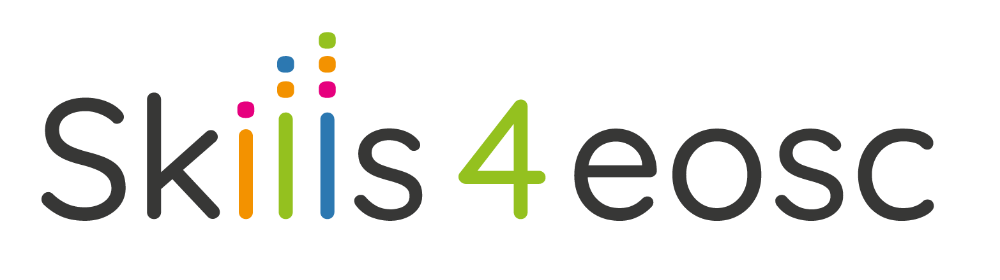

## Slides

[Download the slides here](https://github.com/FAIR-by-Design-Methodology/IDCC24workshop/raw/main/resources/02%20Skills4EOSC/Skills4EOSC-IDCCworkshop_FAIR-by-Design_Methodology.pptx){:download}

# Introduction to Skills4EOSC

Skills4EOSC ‘Skills for the European Open Science commons: creating a training ecosystem for Open and FAIR science’ is funded by the European Commission Horizon Europe programme (GA 101058527).

The project is coordinated by Consortium GARR and supported by 44 partners in 18 European countries.

The project officially started on the 1st of September 2022 and lasts until 31st of August 2025.

The main goals of the Skills4EOSC project are as follows:

1. **Define Minimum Viable Skills**: Establish a set of essential skills that are crucial for engaging in Open Science, ensuring these skills are aligned with the needs of the European Open Science Cloud (EOSC) ecosystem.
2. **Develop Fair-by-Design Learning Materials**: Create educational resources and training programs that adhere to the FAIR principles (Findable, Accessible, Interoperable, Reusable), facilitating widespread adoption and use across various educational and research institutions.
3. **Establish Recognition Frameworks**: Develop frameworks for recognizing and validating Open Science skills, including the use of Open Badges and European Digital Credentials. This recognition aims to provide a formal and credible way to acknowledge the skills acquired by participants.
4. **Collaborate with Educational Institutions**: Work with universities and other educational bodies to integrate Open Science skills into formal curricula, potentially offering academic credits (ECTS points) for completed training.
5. **Promote Sustainability**: Ensure the long-term sustainability of Open Science skills development through robust governance structures, continuous updating of skills repositories, and fostering collaboration among key stakeholders.
6. **Support Integration of Research Ethics and Integrity**: Provide tools and best practices to help integrate ethical, legal, and societal considerations into Open Science, ensuring that research conducted within the EOSC framework adheres to high standards of integrity and ethics.

The main project resources such as **deliverables and milestones, presentations and videos** can be found in [the resources part of the SKills4EOSC website](https://www.skills4eosc.eu/resources).

The [network part of the Skills4EOSC website](https://www.skills4eosc.eu/network) provides information about the Network of Competence Centers and the User Support Network.

[The Skills4EOSC learning platform](https://learning.skills4eosc.eu/) hosts the already fully developed learning materials within the project on different topics.

There is also [a registry of the Skills4EOSC training courses](https://www.skills4eosc.eu/participate/skills4eosc-training-courses) that provide a short overview of what is available.

All of the deliverables, milestones and other relevant project outputs are developed using a **co-creation process**. This means that once the initial draft is completed, the material is shared with the public so that comments and opinions can be gathered and included in the final version. The list of [materials for community review](https://www.skills4eosc.eu/participate/materials-for-community-review) provides an easy access to the EU surveys which you can use to provide your feedback on a given topic.

# Summary 

Skills4EOSC aims to build a comprehensive and sustainable framework for Open Science skills development, ensuring that European researchers and data stewards are well-equipped to contribute to the evolving landscape of Open Science.

# Suggested Reading

- [Skills4EOSC Website](https://www.skills4eosc.eu/)
- [Skills4EOSC Learning Platform](https://learning.skills4eosc.eu/)
- [Skills4EOSC Zenodo community](https://zenodo.org/communities/skills4eosc/records?q=&l=list&p=1&s=10&sort=newest)

