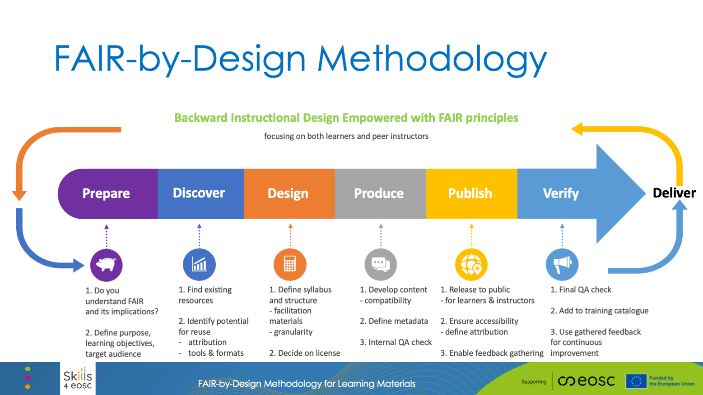

# Slides (new)

[Download the slides here](https://github.com/FAIR-by-Design-Methodology/IDCC24workshop/raw/main/resources/02%20Skills4EOSC/Skills4EOSC-IDCCworkshop_FAIR-by-Design_Methodology.pptx){:download}

# Introduction

The FAIR-by-Design methodology for learning materials refers to an approach where educational resources are created and managed in a way that aligns with the FAIR principles: Findable, Accessible, Interoperable, and Reusable. This methodology ensures that learning materials, such as course content, training modules, and educational resources, are not only well-structured and high-quality but also meet specific criteria that make them easier to discover, use, and adapt within the Open Science ecosystem.

In this way the methodology guarantees that the produced materials will be **FAIR not just from the point of view of the learners, but also other designers and trainers** that would like to reuse and adapt the materials for their own purposes. 

# FAIR-by-Design Methodology for Learning Materials

The FAIR-by-Design Methodology is created around the popular backward instructional design process that is used to develop high-quality learner-centric materials. We have taken the steps of the backward instruction design process and added additional considerations to ensure that the process will be aimed towards the design of FAIR learning content from both the perspective of the learners and the perspective of the instructional designers and trainers.

The methodology is broken down into a number of stages that are connected in a feedback loop thus enabling continuous improvement:

1. Prepare
    - In the Prepare stage the instructional designers need to expand their skillset so that they can practically implement the **FAIR principles**. This means that in addition to the traditional instructional design skills, they should also be able to work with PIDs, repositories and catalogues, use a corresponding metadata schema, choose a license, and know how to acknowledge reused work with attribution.
    - One of the important tasks in this stage is to familiarize with the **RDA minimal metadata schema** for learning resources as this is the basis for the description of the FAIR learning materials.

  

   <!-- 
 -->
   

      <!-- 
 -->
      
<i class="fa fa-fast-backward" aria-hidden="true"></i> Think backward

      

        <h5 class="card-title">Step 1</h5>
        
What are your desired effects, i.e. learning outcomes?

      

    

  

  

    

      
<i class="fa fa-fast-backward" aria-hidden="true"></i> Think backward

      

        <h5 class="card-title">Step 2</h5>
        
How are you going to assess the learners' achievements?

      

    

  

  

    

      
<i class="fa fa-fast-backward" aria-hidden="true"></i> Think backward

      

        <h5 class="card-title">Step 3</h5>
        
How should you structure the material to reach them?

      

    

  

    - This is the initial stage of the learning materials development process and thus it is important that in this stage the designer **clearly defines the purpose of the learning materials, the target audience and the learning objectives** while taking into consideration any prerequisites. 

-   :material-flag-checkered:{ .lg .middle } __Purpose__

    ---

    When and how the learning materials can be used and for what purposes?

-   :material-target-account:{ .lg .middle } __Target Audience__

    ---

    Is there anything specific that needs to be taken into account, such as cultural context?

-   :material-history:{ .lg .middle } __Prerequisites__

    ---

    What does the target audience need to know or understand before starting the learning process?

-   :material-target-account:{ .lg .middle } __Scope__

    ---

    Is it going to be a single learning unit, or a group such as a course?

-   :material-bullseye-arrow:{ .lg .middle } __Learning Objectives__

    ---

    What competences will be gained after successful completing of the learning process?

    ??? info "Be SMART"

        Objectives should be **s**pecific, **m**easurable, **a**ttainable, **r**elevant and **t**ime-bound.

    ??? hint "Use Blooms Taxonomy"
    
        Formulate the objectives as actionable verb + observable knowledge, skill, attitude, behavior or ability.

    [:octicons-arrow-right-24: Read more](https://fair-by-design-methodology.github.io/FAIR-by-Design_ToT/latest/Stage%201%20%E2%80%93%20Prepare/02-Preparing%20FAIR%20Learning%20Objects/02-Preparing%20FAIR%20Learning%20Objects_cont/#defining-learning-objectives)

2. Discover
    - Once the vision of what needs to be created is clear, the next step is to discover **any existing learning materials that can be reused** or simply serve as inspiration. For these purposes the designer needs to search different types of repositories that might host similar learning materials including OER repositories, learning platforms, general repositories and catalogues, as well as multimedia repositories that can provide sources of audio/visual props that are essential in multi-modal learning.

-   :material-open-source-initiative:{ .lg .middle } __OER__

    ---

    [DOAB](https://directory.doabooks.org/)

    [MERLOT](https://www.merlot.org/merlot/index.htm)
    
    [OASIS](https://oasis.geneseo.edu/index.php)
    
    [OER Commons](https://www.oercommons.org/)
    
    [OERTX CORA](https://www.projectcora.org/)
    
    [GALILEO](https://oer.galileo.usg.edu/)
    
    [FORRT](https://forrt.org/)

-   :material-cloud-circle-outline:{ .lg .middle } __EOSC__

    ---

    [EOSC Training catalogue on the EOSC Marketplace](https://search.marketplace.eosc-portal.eu/search/training?q=*)
    
    Most EOSC projects have their own training catalogues and/or platforms...
    

-   :material-book:{ .lg .middle } __General__

    ---

    [Creative Commons Search](https://search.creativecommons.org/) - content provided under a CC license

    [Zenodo](https://zenodo.org/) - a multi-disciplinary open repository

    [OSF](https://osf.io/) - a free, open research platform
    

3. Design
    - At this stage the designer has a clear idea of what is needed and what already exists. The next step is to sketch a **conceptual map** of the learning materials that will help crystalize the ideas and prepare the syllabus for the learning materials. The syllabus is then used as a high-level blueprint for the development of the learning materials.
    - In the design stage the **overall structure of the learning materials** is defined identifying all modules and learning units necessary together with the information on what can be reused and what needs to be designed from scratch. Careful attention should be put on license compatibility during this work.

- <i class="fa fa-cogs" aria-hidden="true"></i> Create an intuitive logical organisation of all learning materials. 
- <i class="fa fa-cubes" aria-hidden="true"></i> The goal is for other people to easily reuse a single item (plan, activity, unit, assessment, ...).
- <i class="fa fa-sitemap" aria-hidden="true"></i> Use a hierarchical structure to combine learning units into larger compositions.

    - Upon completing the structure, each learning unit needs to be designed using a modeling technique such as the Hunter's model 
    - The design stage should also take into account the need for **development of a facilitation guide** that explains in details how to prepare and put the training into practice, as well as a feedback form that should be used to gather feedback after the learning process has finished
4. Produce
    - When the design is complete, it is time to move to the produce stage and **choose the tools and file formats** necessary to develop all of the content. Care must be taken that the chosen file formats are open so that reusability is supported, and it is recommended that a **collaborative, versioning system** is used to keep track of all contributions and changes. It is important to consider both the editable files that can be reused by trainers and the final file formats intended for learners.

??? info "Collaborative environment for team work"

    Choose an environment for producing the learning material that will enable multiple people to work on the same material at one. Two examples are workplace or GitHub (find out more <a href='https://fair-by-design-methodology.github.io/FAIR-by-Design_ToT/latest/Stage%204%20–%20Produce/08-Development%20Tools/08-Introduction%20to%20Markdown%20and%20Git/'>here</a>). Replicate the folder tree in the environment and start using the provided templates to generate the content.

??? tip "Granular versioning for easy rollback"

    Versioning helps you maintain control over your changes. If the collaborative environment does not provide versioning and history retention then keep a history of the files by adopting a naming convention such as combining the file name with an increasing version number.

??? success "Open file formats to foster reuse "

    For other people to reuse your materials they should be made available using open file formats (docx, pptx, pdf, md, html, etc.). If you use close file formats then you MUST clearly state the tools that have been used for development in your README file.

??? warning "Multimodal content to reach all audience"

    Don't forget to include different types of multimedia to provide support for different learning modalities: read/write, auditory, visual, kinesthetic.
    
??? example "Two file sets: editable + final"

    Always work with and keep a history of your editable files. These are what matters for you and other instructors. The second set of final files should be obtained from the editable when needed (before distributing them to the learners). The final files should be kept on the learning platform only. In this way you don't need to worry about keeping the versions in sync.

??? bug "Don't forget to support co-creation"

    Truly FAIR learning materials should enable co-creation with external parties. If you don't use a collaborative environment that supports this from the start (such as GitHub), then think how are you going to enable this in the future and how are you going to deal with versioning then.

    - One of the most important aspects of the produce stage is **accessibility of the developed learning materials**. Accessibility standards should be followed so as to maximize the audience for the learning materials. 
    - During this stage the designers must not forget to add the **human-readable and machine-readable metadata** in the developed content as well as to develop the content of all facilitation documents such as the guide, activities description, lesson plans, etc.
    - The final step in the produce stage is to perform an **internal Quality Assessment** that will check that all elements are present and that the content is adequate.
5. Publish
    - A satisfactory completion of the internal QA leads to the publication steps. Before the actual publication, very important final touches need to be done including activities such as the definition of the content of **accompanying files**: license, readme, citation, code of conduct and alike.
    - Once all necessary elements are in place, the learning materials can be **published to a selected repo**. If GitHub was chosen as the repository in the Produce stage, then the automated bridge between GitHub and Zenodo can be used to create a Zenodo record and obtain a DOI PID for the learning materials. This records is primarily intended for reuse by other designers and trainers. 
    - In addition, the complete learning environment should be setup in a learning platform where the **final file formats will be provided to the learners**.
6. Verify
    - The final steps in the methodology is to perform another QA round, this time focusing on **external QA**. At this stage the overall level of FAIRness of the learning materials needs to be checked and external experts should be used to provide unbiased feedback regarding the quality of the produced materials. 
    - This stage also focuses on setting up different mechanism for gathering feedback so that the learning materials can be further improved. In this way it fosters **the co-creation process** that empowers learners and other designers and trainers to actively participate in the development.
7. Continuous Improvement
    - The gathered internal and external feedback should be used as input for the **development of a new version** of the learning materials.
    - Upon the identification of potential improvements that should be implemented, the development process circles back to the first stage aiming to publish a new improved version of the learning materials.

# Summary

The FAIR-by-Design methodology proposes six stages that aim to ensure that the end result will be FAIR Learning Materials that are:

1. **Findable**: Learning materials are indexed in a way that makes them easily discoverable by both humans and machines. This typically involves assigning persistent identifiers, such as DOIs, and providing rich metadata that includes detailed descriptions, keywords, and other information that facilitates search and discovery.
2. **Accessible**: The materials are available to users under clear conditions, often through open access platforms. This means ensuring that the resources can be accessed by anyone with the appropriate permissions or licenses, without unnecessary barriers like paywalls or restrictive access conditions.
3. **Interoperable**: Learning materials are designed to be compatible with various systems and tools. This involves using standardized formats, protocols, and vocabularies that enable the integration and use of the materials across different platforms, enhancing the ability to mix, match, and repurpose content.
4. **Reusable**: The resources are created with reuse in mind, allowing others to easily adapt or repurpose them for different contexts. This requires clear licensing, proper documentation, and a modular design that facilitates modification and customization.

# Suggested Reading

- [Skills4EOSC FAIR-by-Design Methodology for Learning Materials Development](https://zenodo.org/records/8419242)
- [FAIR-by-Design Learning Materials Methodology Training of Trainers on Zenodo](https://zenodo.org/records/10063110)
- [FAIR-by-Design Learning Materials Methodology Training of Trainers on LMS](https://learning.skills4eosc.eu/course/view.php?id=19)
- [FAIR-by-Design Learning Materials Methodology Training of Trainers on GitHub](https://github.com/FAIR-by-Design-Methodology/FAIR-by-Design_ToT)
- [FAIR-by-Design Learning Materials Methodology Training of Trainers GitBook](https://fair-by-design-methodology.github.io/FAIR-by-Design_ToT/latest/)
- [FAIR-by-Design Learning Materials Methodology Templates Repository](https://github.com/FAIR-by-Design-Methodology/templates)

