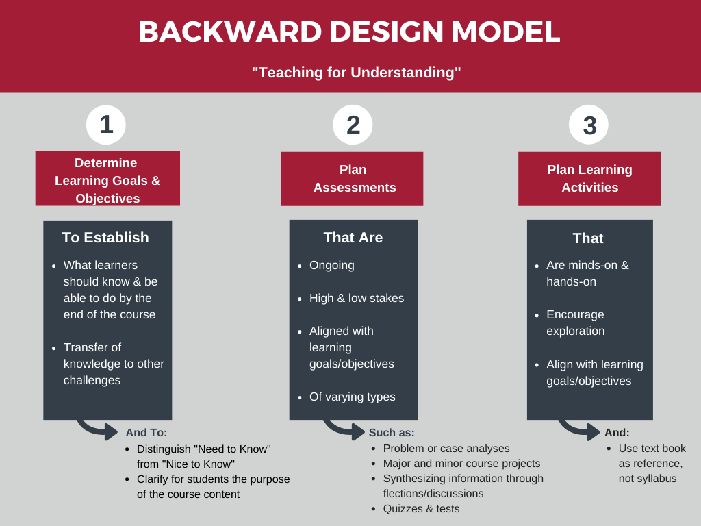

# Slides (new)

[Download the slides regarding the FAIR-by-Design Methodology here](https://github.com/FAIR-by-Design-Methodology/IDCC24workshop/raw/main/resources/02%20Skills4EOSC/Skills4EOSC-IDCCworkshop_FAIR-by-Design_Methodology.pptx){:download}

# Introduction

## Metadata and Metadata Schema

Metadata is one of the key ingredients to making learning resources findable, accessible, and reusable. In essence, metadata consists of structured information that describes, explains and locates a resource.

The main purpose of the (meta)data about the learning resource is to enable cataloguing and discovery by providing a standard means to report on:

- WHO created the resource
- WHAT is the content of the resource
- WHEN was the resource created
- WHERE is the location of the resource
- WHY the data was resource

Example metadata for a language dataset

Using this information a learner or instructor should be able to:

- Search and retrieve the information about a learning resource 
- Determine if the learning resource meets certain learning requirements
- Discover how to acquire and use the learning resource

### RDA Minimal Metadata for Learning Resources

The [RDA Education And Training On Handling Of Research Data Interest Group](https://www.rd-alliance.org/groups/education-and-training-handling-research-data.html) has defined a [minimal metadata set for learning resources](https://zenodo.org/record/6769695#.YrrP9-xBybQ) that has become a de facto standard for describing FAIR learning materials.

The following table describes the minimal metadata set elements and their definitions:

| **Element Name** | **Definition** |
|---|---|
| Title | The human readable name of the resource. |
| Abstract / Description | A brief synopsis about or description of the learning resource |
| Author(s) | Name of entity(ies) authoring the resource |
| Primary Language | Language in which the resource was originally published or made available |
| Keyword(s) | Keywords or tags used to describe the resource |
| License | A license document that applies to this content, typically indicated by URL |
| Version Date | Version date for the most recently published or broadcast resource |
| URL to Resource | URL that resolves to the learning resource or to a "landing page" for the resource that contains important contextual information  including the direct resolvable link to the resource, if applicable. |
| Resource URL Type | Designation of the identifier scheme  used for the resource URL, e.g., DOI, ARK, Handle |
| Target Group (Audience) | Principal users(s) for which the resource was designed |
| Learning Resource Type | The predominant type or kind that characterizes the learning resource |
| Learning Outcome | Descriptions of what knowledge, skills or abilities a learner should acquire on completion of the resource |
| Access Cost | Choice stating whether or not there is a fee for use of the resource (yes, no, maybe) |
| Expertise (Skill) Level | Target skill level in the topic being taught; example values include beginner, intermediate, advanced |

This table is taken from [RDA Minimal Metadata for Learning Resources](https://doi.org/10.15497/RDA00073) by Hoebelheinrich, Nancy J; Biernacka, Katarzyna; Brazas, Michelle; Castro, Leyla Jael; Fiore, Nicola; Hellström, Margareta; Lazzeri, Emma; Leenarts, Ellen; Martinez Lavanchy, Paula Maria; Newbold, Elizabeth; Nurnberger, Amy; Plomp, Esther; Vaira, Lucia; van Gelder, Celia W G; Whyte, Angus licensed under the [CC BY 4.0 license](https://creativecommons.org/licenses/by/4.0/legalcode).

These elements need to be standardized so that they are useful when used in practice. This is done by defining a metadata schema that describes the structure of the metadata elements. The metadata schema defines the standards for describing the metadata elements.

The metadata schema for learning resources that also defines the type of each element, the allowed values, and constraints is available on the RDA website: [RDA Minimal Metadata for Learning Resources Professional and Informal Education Examples](https://www.rd-alliance.org/system/files/Copy%20of%20Examples%20for%20Professional%20and%20Informal%20Education.pdf)

### Controlled Vocabularies

Some of the fields in the proposed RDA metadata schema are based on fixed or suggested controlled vocabularies (CV). The use of controlled vocabularies is to help humans and machines categorize the information while helping to reduce duplication and errors. 

In essence, controlled vocabularies should be used for any metadata elements with predefined value(s), where in the vocabulary is presented as a list of prescribed items. 

Such examples are 

- Access Cost with possible values of Y, N and Maybe
- Primary Language that can be a two letter code from the [ISO 639-1:2002 codeset](https://en.wikipedia.org/wiki/List_of_ISO_639-1_codes)

In the Skills4EOSC project, a specific example of using controlled vocabularies are different lists of OS Skills Terms

#### List of OS Skills Terms

=== "t4FS"
    t4FS: 84 (of 223 in total) 'data stewardship activity' terms, selected for relevance and appropriate level of granularity, mainly from 2nd level of t4FS hierarchy; sorted alphabetically here; italicised terms have been reworded for clarity.

    - [*Access control & authorisation management*](https://www.ebi.ac.uk/ols4/ontologies/t4fs/classes/http%253A%252F%252Fpurl.obolibrary.org%252Fobo%252FT4FS_0000142?lang=en)
    - [*Assessment on FAIR data criteria*](https://www.ebi.ac.uk/ols4/ontologies/t4fs/classes/http%253A%252F%252Fpurl.obolibrary.org%252Fobo%252FT4FS_0000252?lang=en)
    - [Audit and evaluation](https://www.ebi.ac.uk/ols4/ontologies/t4fs/classes/http%253A%252F%252Fpurl.obolibrary.org%252Fobo%252FT4FS_0000225?lang=en)
    - [Change management](https://www.ebi.ac.uk/ols4/ontologies/t4fs/classes/http%253A%252F%252Fpurl.obolibrary.org%252Fobo%252FT4FS_0000411?lang=en)
    - [*Cloud environment management*](https://www.ebi.ac.uk/ols4/ontologies/t4fs/classes/http%253A%252F%252Fpurl.obolibrary.org%252Fobo%252FT4FS_0000479?lang=en)
    - [Community building](https://www.ebi.ac.uk/ols4/ontologies/t4fs/classes/http%253A%252F%252Fpurl.obolibrary.org%252Fobo%252FT4FS_0000249?lang=en)
    - [Creativity](https://purl.obolibrary.org/obo/T4FS_0000165)
    - [*Crediting research contributors*](https://www.ebi.ac.uk/ols4/ontologies/t4fs/classes/http%253A%252F%252Fpurl.obolibrary.org%252Fobo%252FT4FS_0000183?lang=en)
    - [*Data access risk assessment and mitigation*](https://www.ebi.ac.uk/ols4/ontologies/t4fs/classes/http%253A%252F%252Fpurl.obolibrary.org%252Fobo%252FT4FS_0000209?lang=en)
    - [Data acquisition](https://www.ebi.ac.uk/ols4/ontologies/t4fs/classes/http%253A%252F%252Fpurl.obolibrary.org%252Fobo%252FT4FS_0000231?lang=en)
    - [Data analysis](https://www.ebi.ac.uk/ols4/ontologies/t4fs/classes/http%253A%252F%252Fpurl.obolibrary.org%252Fobo%252FT4FS_0000352?lang=en)
    - [*Data anonymisation and de-identification*](https://www.ebi.ac.uk/ols4/ontologies/t4fs/classes/http%253A%252F%252Fpurl.obolibrary.org%252Fobo%252FT4FS_0000414?lang=en)
    - [Data archiving](https://www.ebi.ac.uk/ols4/ontologies/t4fs/classes/http%253A%252F%252Fpurl.obolibrary.org%252Fobo%252FT4FS_0000534?lang=en)
    - [Data categorisation](https://www.ebi.ac.uk/ols4/ontologies/t4fs/classes/http%253A%252F%252Fpurl.obolibrary.org%252Fobo%252FT4FS_0000018?lang=en)
    - [Data citation](https://www.ebi.ac.uk/ols4/ontologies/t4fs/classes/http%253A%252F%252Fpurl.obolibrary.org%252Fobo%252FT4FS_0000302?lang=en)
    - [*Data costs management*](https://www.ebi.ac.uk/ols4/ontologies/t4fs/classes/http%253A%252F%252Fpurl.obolibrary.org%252Fobo%252FT4FS_0000232?lang=en)
    - [Data curation](https://www.ebi.ac.uk/ols4/ontologies/t4fs/classes/http%253A%252F%252Fpurl.obolibrary.org%252Fobo%252FT4FS_0000132?lang=en)
    - [Data destruction](https://www.ebi.ac.uk/ols4/ontologies/t4fs/classes/http%253A%252F%252Fpurl.obolibrary.org%252Fobo%252FT4FS_0000161?lang=en)
    - [Data discovery](https://www.ebi.ac.uk/ols4/ontologies/t4fs/classes/http%253A%252F%252Fpurl.obolibrary.org%252Fobo%252FT4FS_0000076?lang=en)
    - [Data driven decision management](https://www.ebi.ac.uk/ols4/ontologies/t4fs/classes/http%253A%252F%252Fpurl.obolibrary.org%252Fobo%252FT4FS_0000504?lang=en)
    - [Data exploration](https://www.ebi.ac.uk/ols4/ontologies/t4fs/classes/http%253A%252F%252Fpurl.obolibrary.org%252Fobo%252FT4FS_0000354?lang=en)
    - [Data governance](https://www.ebi.ac.uk/ols4/ontologies/t4fs/classes/http%253A%252F%252Fpurl.obolibrary.org%252Fobo%252FT4FS_0000458?lang=en)
    - [Data harmonization](https://www.ebi.ac.uk/ols4/ontologies/t4fs/classes/http%253A%252F%252Fpurl.obolibrary.org%252Fobo%252FT4FS_0000375?lang=en)
    - [Data ingestion](https://www.ebi.ac.uk/ols4/ontologies/t4fs/classes/http%253A%252F%252Fpurl.obolibrary.org%252Fobo%252FT4FS_0000290?lang=en)
    - [Data integration](https://www.ebi.ac.uk/ols4/ontologies/t4fs/classes/http%253A%252F%252Fpurl.obolibrary.org%252Fobo%252FT4FS_0000487?lang=en)
    - [Data mining](https://www.ebi.ac.uk/ols4/ontologies/t4fs/classes/http%253A%252F%252Fpurl.obolibrary.org%252Fobo%252FT4FS_0000533?lang=en)
    - [Data modeling](https://www.ebi.ac.uk/ols4/ontologies/t4fs/classes/http%253A%252F%252Fpurl.obolibrary.org%252Fobo%252FT4FS_0000065?lang=en)
    - [Data policy](https://www.ebi.ac.uk/ols4/ontologies/t4fs/classes/http%253A%252F%252Fpurl.obolibrary.org%252Fobo%252FT4FS_0000333)
    - [Data processing](https://www.ebi.ac.uk/ols4/ontologies/t4fs/classes/http%253A%252F%252Fpurl.obolibrary.org%252Fobo%252FT4FS_0000044?lang=en)
    - [Data production](https://www.ebi.ac.uk/ols4/ontologies/t4fs/classes/http%253A%252F%252Fpurl.obolibrary.org%252Fobo%252FT4FS_0000108?lang=en)
    - [Data profiling](https://www.ebi.ac.uk/ols4/ontologies/t4fs/classes/http%253A%252F%252Fpurl.obolibrary.org%252Fobo%252FT4FS_0000516?lang=en)
    - [*Data quality assessment*](https://www.ebi.ac.uk/ols4/ontologies/t4fs/classes/http%253A%252F%252Fpurl.obolibrary.org%252Fobo%252FT4FS_0000153?lang=en)
    - [*Data quality assessment & review*](https://www.ebi.ac.uk/ols4/ontologies/t4fs/classes/http%253A%252F%252Fpurl.obolibrary.org%252Fobo%252FT4FS_0000406?lang=en)
    - [Data recovery](https://www.ebi.ac.uk/ols4/ontologies/t4fs/classes/http%253A%252F%252Fpurl.obolibrary.org%252Fobo%252FT4FS_0000173?lang=en)
    - [Data registration](https://www.ebi.ac.uk/ols4/ontologies/t4fs/classes/http%253A%252F%252Fpurl.obolibrary.org%252Fobo%252FT4FS_0000019?lang=en)
    - [Data repository management](https://www.ebi.ac.uk/ols4/ontologies/t4fs/classes/http%253A%252F%252Fpurl.obolibrary.org%252Fobo%252FT4FS_0000544?lang=en)
    - [Data rescue](https://www.ebi.ac.uk/ols4/ontologies/t4fs/classes/http%253A%252F%252Fpurl.obolibrary.org%252Fobo%252FT4FS_0000046?lang=en)
    - [Data scaling](https://www.ebi.ac.uk/ols4/ontologies/t4fs/classes/http%253A%252F%252Fpurl.obolibrary.org%252Fobo%252FT4FS_0000522?lang=en)
    - [Data selection](https://www.ebi.ac.uk/ols4/ontologies/t4fs/classes/http%253A%252F%252Fpurl.obolibrary.org%252Fobo%252FT4FS_0000074?lang=en)
    - [Data sharing and publication](https://www.ebi.ac.uk/ols4/ontologies/t4fs/classes/http%253A%252F%252Fpurl.obolibrary.org%252Fobo%252FT4FS_0000247?lang=en)
    - [*Data stewardship coordination*](https://www.ebi.ac.uk/ols4/ontologies/t4fs/classes/http%253A%252F%252Fpurl.obolibrary.org%252Fobo%252FT4FS_0000029?lang=en)
    - [Data transformation](https://www.ebi.ac.uk/ols4/ontologies/t4fs/classes/http%253A%252F%252Fpurl.obolibrary.org%252Fobo%252FT4FS_0000069?lang=en)
    - [*Data validation and cleaning*](https://www.ebi.ac.uk/ols4/ontologies/t4fs/classes/http%253A%252F%252Fpurl.obolibrary.org%252Fobo%252FT4FS_0000238?lang=en)
    - [Data wrangling](https://www.ebi.ac.uk/ols4/ontologies/t4fs/classes/http%253A%252F%252Fpurl.obolibrary.org%252Fobo%252FT4FS_0000291?lang=en)
    - [*Depositing in repository*](https://www.ebi.ac.uk/ols4/ontologies/t4fs/classes/http%253A%252F%252Fpurl.obolibrary.org%252Fobo%252FT4FS_0000298?lang=en)
    - [Digital archiving](https://www.ebi.ac.uk/ols4/ontologies/t4fs/classes/http%253A%252F%252Fpurl.obolibrary.org%252Fobo%252FT4FS_0000537?lang=en)
    - [Digital format and media migration](https://www.ebi.ac.uk/ols4/ontologies/t4fs/classes/http%253A%252F%252Fpurl.obolibrary.org%252Fobo%252FT4FS_0000214?lang=en)
    - [Digital scholarship](https://www.ebi.ac.uk/ols4/ontologies/t4fs/classes/http%253A%252F%252Fpurl.obolibrary.org%252Fobo%252FT4FS_0000087?lang=en)
    - [Digitisation](https://www.ebi.ac.uk/ols4/ontologies/t4fs/classes/http%253A%252F%252Fpurl.obolibrary.org%252Fobo%252FT4FS_0000245?lang=en)
    - [knowledge to contextualise fair principles to domain](https://purl.obolibrary.org/obo/T4FS_0000296)
    - [Ethical application of patents, licenses](https://www.ebi.ac.uk/ols4/ontologies/t4fs/classes/http%253A%252F%252Fpurl.obolibrary.org%252Fobo%252FT4FS_0000042?lang=en)
    - [*Evaluating repositories for data deposit/sharing*](https://www.ebi.ac.uk/ols4/ontologies/t4fs/classes/http%253A%252F%252Fpurl.obolibrary.org%252Fobo%252FT4FS_0000175?lang=en)
    - [Identity management](https://www.ebi.ac.uk/ols4/ontologies/t4fs/classes/http%253A%252F%252Fpurl.obolibrary.org%252Fobo%252FT4FS_0000169?lang=en)
    - [Information governance](https://www.ebi.ac.uk/ols4/ontologies/t4fs/classes/http%253A%252F%252Fpurl.obolibrary.org%252Fobo%252FT4FS_0000331?lang=en)
    - [Information security](https://www.ebi.ac.uk/ols4/ontologies/t4fs/classes/http%253A%252F%252Fpurl.obolibrary.org%252Fobo%252FT4FS_0000107?lang=en)
    - [Interface testing](https://www.ebi.ac.uk/ols4/ontologies/t4fs/classes/http%253A%252F%252Fpurl.obolibrary.org%252Fobo%252FT4FS_0000112?lang=en)
    - [Meeting/conference organisation](https://www.ebi.ac.uk/ols4/ontologies/t4fs/classes/http%253A%252F%252Fpurl.obolibrary.org%252Fobo%252FT4FS_0000465?lang=en)
    - [*Mentoring on open and fair methods*](https://www.ebi.ac.uk/ols4/ontologies/t4fs/classes/http%253A%252F%252Fpurl.obolibrary.org%252Fobo%252FT4FS_0000457?lang=en)
    - [*Metadata catalog management*](https://www.ebi.ac.uk/ols4/ontologies/t4fs/classes/http%253A%252F%252Fpurl.obolibrary.org%252Fobo%252FT4FS_0000068?lang=en)
    - [Metadata creation](https://www.ebi.ac.uk/ols4/ontologies/t4fs/classes/http%253A%252F%252Fpurl.obolibrary.org%252Fobo%252FTF4S_0000574?lang=en)
    - [Metadata exposure](https://www.ebi.ac.uk/ols4/ontologies/t4fs/classes/http%253A%252F%252Fpurl.obolibrary.org%252Fobo%252FT4FS_0000160?lang=en)
    - [Open access publishing](https://www.ebi.ac.uk/ols4/ontologies/t4fs/classes/http%253A%252F%252Fpurl.obolibrary.org%252Fobo%252FT4FS_0000193?lang=en)
    - [*Open innovation*](https://www.ebi.ac.uk/ols4/ontologies/t4fs/classes/http%253A%252F%252Fpurl.obolibrary.org%252Fobo%252FT4FS_0000084?lang=en)
    - [*Open peer review*](https://www.ebi.ac.uk/ols4/ontologies/t4fs/classes/http%253A%252F%252Fpurl.obolibrary.org%252Fobo%252FT4FS_0000498?lang=en)
    - [*Persistent identifiers management*](https://www.ebi.ac.uk/ols4/ontologies/t4fs/classes/http%253A%252F%252Fpurl.obolibrary.org%252Fobo%252FT4FS_0000492?lang=en)
    - [Preservation](https://www.ebi.ac.uk/ols4/ontologies/t4fs/classes/http%253A%252F%252Fpurl.obolibrary.org%252Fobo%252FT4FS_0000017?lang=en)
    - [Preservation costs management](https://www.ebi.ac.uk/ols4/ontologies/t4fs/classes/http%253A%252F%252Fpurl.obolibrary.org%252Fobo%252FT4FS_0000104?lang=en)
    - [Privacy governance](https://www.ebi.ac.uk/ols4/ontologies/t4fs/classes/http%253A%252F%252Fpurl.obolibrary.org%252Fobo%252FT4FS_0000524?lang=en)
    - [Programme governance](https://www.ebi.ac.uk/ols4/ontologies/t4fs/classes/http%253A%252F%252Fpurl.obolibrary.org%252Fobo%252FT4FS_0000203?lang=en)
    - [Project management](https://www.ebi.ac.uk/ols4/ontologies/t4fs/classes/http%253A%252F%252Fpurl.obolibrary.org%252Fobo%252FT4FS_0000323?lang=en)
    - [Provenance information management](https://www.ebi.ac.uk/ols4/ontologies/t4fs/classes/http%253A%252F%252Fpurl.obolibrary.org%252Fobo%252FT4FS_0000368?lang=en)
    - [Research governance](https://www.ebi.ac.uk/ols4/ontologies/t4fs/classes/http%253A%252F%252Fpurl.obolibrary.org%252Fobo%252FT4FS_0000186?lang=en)
    - [*Research integrity process design*](https://www.ebi.ac.uk/ols4/ontologies/t4fs/classes/http%253A%252F%252Fpurl.obolibrary.org%252Fobo%252FT4FS_0000216?lang=en)
    - [Research integrity, attribution, impact awareness](https://www.ebi.ac.uk/ols4/ontologies/t4fs/classes/http%253A%252F%252Fpurl.obolibrary.org%252Fobo%252FT4FS_0000525?lang=en)
    - [Research management](https://www.ebi.ac.uk/ols4/ontologies/t4fs/classes/http%253A%252F%252Fpurl.obolibrary.org%252Fobo%252FT4FS_0000314?lang=en)
    - [Resource management](https://www.ebi.ac.uk/ols4/ontologies/t4fs/classes/http%253A%252F%252Fpurl.obolibrary.org%252Fobo%252FT4FS_0000353?lang=en)
    - [*Securing networks for data integrity*](https://www.ebi.ac.uk/ols4/ontologies/t4fs/classes/http%253A%252F%252Fpurl.obolibrary.org%252Fobo%252FT4FS_0000086?lang=en)
    - [*Securing sustainable funding*](https://www.ebi.ac.uk/ols4/ontologies/t4fs/classes/http%253A%252F%252Fpurl.obolibrary.org%252Fobo%252FT4FS_0000426?lang=en)
    - [*Selecting appropriate data handling methods*](https://www.ebi.ac.uk/ols4/ontologies/t4fs/classes/http%253A%252F%252Fpurl.obolibrary.org%252Fobo%252FT4FS_0000367?lang=en)
    - [Service level management](https://www.ebi.ac.uk/ols4/ontologies/t4fs/classes/http%253A%252F%252Fpurl.obolibrary.org%252Fobo%252FT4FS_0000466?lang=en)
    - [Software preservation](https://www.ebi.ac.uk/ols4/ontologies/t4fs/classes/http%253A%252F%252Fpurl.obolibrary.org%252Fobo%252FT4FS_0000004?lang=en)
    - [Stakeholder engagement on societal impact](https://www.ebi.ac.uk/ols4/ontologies/t4fs/classes/http%253A%252F%252Fpurl.obolibrary.org%252Fobo%252FT4FS_0000439?lang=en)
    - [Storage management](https://www.ebi.ac.uk/ols4/ontologies/t4fs/classes/http%253A%252F%252Fpurl.obolibrary.org%252Fobo%252FT4FS_0000053?lang=en)
    - [Strategic/long-term planning](https://www.ebi.ac.uk/ols4/ontologies/t4fs/classes/http%253A%252F%252Fpurl.obolibrary.org%252Fobo%252FT4FS_0000514?lang=en)
    - [*Training in open and fair methods*](https://www.ebi.ac.uk/ols4/ontologies/t4fs/classes/http%253A%252F%252Fpurl.obolibrary.org%252Fobo%252FT4FS_0000259?lang=en)
    - [User acceptance testing](https://www.ebi.ac.uk/ols4/ontologies/t4fs/classes/http%253A%252F%252Fpurl.obolibrary.org%252Fobo%252FT4FS_0000158?lang=en)

=== "CSCCE"
    CSCCE  Glossary: 45 terms listed according to 5 dimensions, selecting those included in 'skills wheel' for scientific community managers

    - **Interpersonal**
        - [Engagement](https://www.cscce.org/glossary/engagement/)
        - [Collaboration](https://www.cscce.org/glossary/collaboration/)
        - [Teaching and training](https://www.cscce.org/glossary/teaching-and-training/)
        - [Networking](https://www.cscce.org/glossary/networking/)
        - [Mentoring](https://www.cscce.org/glossary/mentoring/)
        - [Moderation, mediation and intervention](https://www.cscce.org/glossary/moderation-mediation-and-intervention/)
        - [Emotional integration](https://www.cscce.org/glossary/emotional-integration/)
        - [Cultural competence](https://www.cscce.org/glossary/cultural-competence/)
        - [Consultation and listening](https://www.cscce.org/glossary/consultation-and-listening/)
    - **Program management (= Leadership)**
        - [Operational planning and implementation](https://www.cscce.org/glossary/operational-planning-and-implementation/)
        - [Time management](https://www.cscce.org/glossary/time-management/)
        - [Record-keeping](https://www.cscce.org/glossary/record-keeping/)
        - [Project Reporting](https://www.cscce.org/glossary/reporting/)
        - [Evaluation and assessment](https://www.cscce.org/glossary/evaluation-and-assessment/)
        - [Event planning](https://www.cscce.org/glossary/event-planning/)
        - [Financial management](https://www.cscce.org/glossary/financial-management/)
        - [Community governance](https://www.cscce.org/glossary/community-governance/)
        - [Meeting facilitation](https://www.cscce.org/glossary/meeting-facilitation/)
    - **Program development (= Domain)**
        - [Strategy development](https://www.cscce.org/glossary/strategy-development/)
        - [Landscape analysis](https://www.cscce.org/glossary/analysis/)
        - [Business Modeling](https://www.cscce.org/glossary/synthesis/)
        - [Proposal development](https://www.cscce.org/glossary/proposal-development/)
        - [Advancement, growth and sustainability](https://www.cscce.org/glossary/advancement-growth-and-sustainability/)
        - [Advocacy](https://www.cscce.org/glossary/advocacy/)
        - [Project/programme design](https://www.cscce.org/glossary/program-design/)
        - [Change management](https://www.cscce.org/glossary/change-management/)
        - [Recruitment, welcoming and onboarding](https://www.cscce.org/glossary/recruitment-welcoming-and-onboarding/)
    - **Communication**
        - [Content planning](https://www.cscce.org/glossary/content-planning/)
        - [Content creation and curation](https://www.cscce.org/glossary/content-creation-and-curation/)
        - [Copywriting and editing](https://www.cscce.org/glossary/editorial/)
        - [Marketing and branding](https://www.cscce.org/glossary/marketing-and-branding/)
        - [Knowledge brokering](https://www.cscce.org/glossary/knowledge-brokering/)
        - [Media relations](https://www.cscce.org/glossary/media-relations/)
        - [Outreach](https://www.cscce.org/glossary/outreach/)
        - [Speaking and presenting](https://www.cscce.org/glossary/speaking-and-presenting/)
        - [Social media](https://www.cscce.org/glossary/social-media/)
    - **Technical** 
        - [Media production](https://www.cscce.org/glossary/media-production/)
        - [Data analysis](https://www.cscce.org/glossary/data-analysis/)
        - [Data visualization](https://www.cscce.org/glossary/data-visualization/)
        - [Data management](https://www.cscce.org/glossary/data-management/)
        - [Systems administration and maintenance](https://www.cscce.org/glossary/systems-administration-and-maintenance/)
        - [Product management of technology platforms](https://www.cscce.org/glossary/product-management-of-technology-platforms/)
        - [Web and UI design](https://www.cscce.org/glossary/web-and-ui-design/)
        - [Content Management System (CMS) administration](https://www.cscce.org/glossary/content-management-system-cms-administration/)
        - [Technical support](https://www.cscce.org/glossary/technical-support/)

=== "ResearchComp"
    [ResearchComp](https://research-and-innovation.ec.europa.eu/system/files/2023-04/ec_rtd_research-competence-presentation.pdf)

    **Cognitive abilities**

        1.  Abstract thinking
            - Demonstrate the ability to use concepts in order to make and understand generalisations, and relate or connect them to other items, events, or experiences.
        2.  Critical thinking
            - Exercise critical judgement and thinking, develop own assumptions, and establish a way of working based on critical thinking.
        3.  Analytical thinking
            - Using logic and reasoning to develop alternative solutions, conclusions or approaches to problems and identify their strengths and weaknesses.
        4.  Strategic thinking
            - Develop a vision to turn ideas into action. Obtain and synthesize information to identify and explore trends, opportunities, threats (also based on intuition and creativity) to achieve a long-term goal and to thrive in a competitive, changing environment. Identify alternative paths to turn ideas into action, select the most appropriate approach and adjust where necessary.
        5.  Systemic thinking
            - Understand and take account of the characteristics of (inter)national research systems where researchers interact with all relevant stakeholders and of the position of individual researchers and their organisation within the system. Situate research activities within the wider context to improve the understanding of complex issues and identify linkages with related issues.
        6.  Problem solving
            - Develop and implement solutions to practical, operational or conceptual problems which arise in the execution of work in a wide range of contexts.
        7.  Creativity
            - Develop several ideas and opportunities to create value, including better solutions to existing and new challenges. Explore and experiment with innovative approaches. Combine knowledge and resources to achieve valuable effects.
    
    **Self management**

        8.  Manage personal professional development
            - Take responsibility for lifelong learning and continuous professional development. Engage in learning to support and update professional competence and develop personal skills. Identify priority areas for professional development based on reflection about own practice and through contact with peers and stakeholders. Pursue a cycle of selfimprovement and develop credible career plans.
        9.  Show entrepreneurial spirit
            - Demonstrate a proactive mindset and determination to achieve success in business or successfully create it.
        10.  Plan self-organisation
            - Identify the necessary tasks and prioritise them in order to develop an individual schedule and perform the work in an autonomous way, ensuring that the requirements are met. Understand how to behave and work in a sustainable way, including from the environmental point of view, and be mindful of impact of own activities on the environment.
        11.  Cope with pressure
            - Handle challenges, disruption, and change and recover from set-backs and adversity.
    
    **Working with others**

        12.  Interact professionally
            - Show consideration to others and professional collegial behaviour. Listen, give and receive feedback and respond perceptively to others. Engage effectively and in a goal-directed manner with other people in a professional setting, also involving staff supervision and leadership.
        13.  Develop networks
            - Develop alliances, contacts or partnerships, and exchange information with others. Foster integrated and open collaborations where different stakeholders co-create shared value research and innovations. Develop your personal profile or brand and make yourself visible and accessible in face-to-face and online networking environments.
        14.  Work in teams
            - Work confidently within a group with each doing their part in the service of the whole.
        15.  Ensure wellbeing at work
            - Understand the links between work, physical and mental health and wellbeing. Be adequately informed about health promotion and disease prevention to take responsibility for the personal work situation considering the impact on others to create a healthy work environment.
        16.  Build mentor-mentee relationships
            - Mentor individuals by providing emotional support, sharing experiences and giving advice to the individual to help them in their personal development, as well as adapting the support and guidance to the specific needs of the individual and heeding their requests and expectations. Vice versa, as a mentee, seek support and advice provided by the mentor.
        17.  Promote inclusion & diversity
            - Promote and ensure equality and diversity management, in words as well as in actions and conduct. Guide and advise colleagues about how to work in diverse teams and contexts.
    
    **Doing research**

        18.  Disciplinary expertise
            - Demonstrate deep knowledge and complex understanding of a specific research area, including responsible research, research ethics and integrity principles, privacy and GDPR requirements, related to research activities within a specific discipline.
        19.  Perform scientific research
            - Gain, correct or improve knowledge about phenomena by selecting or developing the appropriate scientific approach and by using scientific methods and research techniques based on empirical or measurable observations.
        20.  Conduct interdisciplinary research
            - Work and use research findings and data across disciplinary/functional boundaries, including in collaborative settings.
        21.  Write research documents
            - Draft and edit research, academic or technical texts on different subjects.
        22.  Apply research ethics and integrity principles
            - Apply fundamental ethical principles and legislation to research and innovation, including issues of research integrity. Perform, review, or report research avoiding misconducts such as fabrication, falsification, and plagiarism.
    
    **Managing research**

        23.  Mobilise resources
            - Identify key relevant funding sources and prepare research grant applications in order to obtain funds and grants. Write research proposals and pitch ideas to convince potential investors (internal or external to the organisation) of the need to fund research initiatives.
        24.  Manage projects
            - Manage and plan various resources, such as human resources, budget, deadline, results, and quality necessary for a specific project and for a project portfolio, and monitor the progress in order to achieve a specific goal within a set time and budget using project management tools.
        25.  Negotiate
            - Exchange ideas while analysing issues and interests at stake, enabling opposing sides to resolve disputes and reach an agreement, or making decisions to resolve disputes.
        26.  Evaluate research
            - Reflect on research activities and learn from successes and failures based on personal experience, feedback from others or monitoring and evaluation. Assess proposals, progress, impact and outcomes of peer researchers.
        27.  Promote open access publishing
            - Develop a strategy to publish your research and identify the appropriate publication channel(s) to implement that strategy. Use open publication strategies when possible. Be familiar with the use of information technology to support research, and with the development and management of CRIS (current research information systems) and institutional repositories. Provide licensing and copyright advice, use bibliometric indicators, and measure and report research impact.
    
    **Managing research tools**

        28.  Manage research data
            - Produce and analyse research data originating from qualitative and quantitative research methods. Store and maintain the data in research databases. Support the re-use of research data and be familiar with data management principles, including FAIR (Findable, Accessible, Interoperable, and Reusable) principles. Make data as open as possible, and as closed as necessary.
        29.  Promote citizen science
            - Engage citizens in scientific and research activities and promote their contribution in terms of knowledge, time or resources invested.
        30.  Manage intellectual property rights
            - Deal with the private legal rights that protect the products of the intellect from unlawful infringement.
        31.  Operate open source software
            - Operate Open-Source software, beyond licensed software, knowing the main Open-Source models, licensing schemes, and the coding practices commonly adopted in the production of Open-Source software.
    
    **Making an Impact**

        32.  Participate in publication process
            - Submit, revise and publish academic research through the most appropriate dissemination means and participate in peer review processes, including open peer review.
        33.  Disseminate results to the research community
            - Publicly disclose research results by any appropriate means, including training, conferences, workshops, colloquia and research publications.
        34.  Teach in academic or vocational context
            - Instruct students in the theory and practice of academic or vocational subjects, transferring the content of own and others’ research activities.
        35.  Communicate to the broad public
            - Communicate about scientific findings to a non-scientific audience, including the general public. Tailor the communication of scientific concepts, debates, findings to the audience, using a variety of methods to different target groups, including visual presentations and various forms of written, spoken and digital communication
        36.  Promote the transfer of knowledge
            - Deploy broad awareness and knowledge of processes of knowledge valorisation aimed to maximise the two–way flow of tools, content material, technology, intellectual property, expertise and capability between the research base and relevant stakeholders within the research field.
        37.  Increase the impact of science on policy and society
            - Increase the impact and use of research findings in policy making, by providing input to and maintaining professional relationships with policymakers and other stakeholders.
        38.  Promote open innovation
            - Apply techniques, models, methods, and strategies that contribute to the promotion of steps towards innovation through collaboration with external people and organizations.

Note that in many cases controlled vocabularies are suggested, but at this stage they are not strictly defined.

Later on during this training, you will learn how and where to define the metadata for your learning resources.

## Syllabus 

Once you have identified your learning concepts, the next step is to sequence them into an instructional sequence (agenda). This instructional sequence will become your blueprint for the organisation of the learning materials and the definition of the syllabus.

In essence the blueprint takes the input from the creative concept map and organizes it into a more formal outline. Formally, we call this learning materials outline syllabus. Each syllabus should provide information regarding a number of elements (including the ones defined in the step 1 of the backward instructional design):

- clear, descriptive **title** 
- description of the **purpose** or goal 
- **target audience**
- **prerequisites**
- **duration**
- **learning objectives**
- **agenda** (instructional sequence)
- **resources and materials**
- **certification** information

Remember that:

- The syllabus can present a higher level sequence outline, that can be later broken down into smaller subtopics if necessary.
- The topics sequence should be defined so that the concepts introduced early help with the ones encountered later. 
- The defined agenda should not be very rigid thus preventing changing the sequence of topics or adding or deleting topics at a later stage.
- The syllabus is sent to the learners and should provide them with all necessary information to help them decide if they want to follow the training related to the learning materials.

### Syllabus Elements

Within this training we recommend the development of a training syllabus that consists of two groups of information:

- typical syllabus information
- additional information related to the RDA minimal metadata schema

The following is a **list of all required syllabus fields**:

- Clear descriptive Title of the training 
- Type (Course/Workshop/Webinar)
- Date/Time: when it will be offered (available from date if it is self-paced)
- Location - where it will be available
    - physical location
    - URL link to resources (and virtual room if online) should lead to the learning Skills4EOSC platform
- Training Description - what is the main goal/purpose of this training
- Target audience: target audience description 
- Expertise Level / Skill Level: Beginner / Intermediate / Advanced
- Primary Language: English
- Access Cost: N 
- Prerequisites - if any
- Duration - total training duration
- Training objectives - list of specific training objectives
- Keywords - Keywords or tags used to describe the training
- Agenda: Training Schedule - Training Structure  (time, topic)
- Resources and Materials - list with locations of available/required resources for the training
- Certification Information - if any
- Author(s) - Comma separated List of people involved in preparing the training (Name Surname)
- Trainer(s) - Comma separated list of people involved in delivering the training (Name Surname ORCID logo link)
- Contact information - how to reach out to training organizers
- License
- PID
- Accessibility Mission

As syllabus is one of the required documents for the FAIR-by-Design learning materials, you must ensure that your syllabus contains **all elements** provided in this section. Only in this way you will ensure that your learning materials contain all necessary metadata information together with the traditional syllabus information that is provided.

## Backward instructional design process

The backward design first focuses on the learning outcomes that one wants to achieve and then works backward to the topics that need to be covered in order to achieve the learning objectives. 

"[Backward design model](http://campdesign.online/documents/backward_design_model_april_2020.pdf)" from [Muhlenberg College](http://campdesign.online/backwarddesign.html) licensed under the [CC BY-NC 4.0](https://creativecommons.org/licenses/by-nc/4.0/). 

By following this process, the learner becomes the focal point of the training, making the developed learning materials learner-centric.

### Ideating a learning resource

According to best practices for the [instructional design process](https://www.skillcast.com/blog/instructional-design-best-practices) in the initial preparation phase (step 1) there should be a clear definition of the **overarching aspects and considerations** related to the learning materials that are going to be created. 

The aspects that need to be defined first are:

- **Purpose** of learning material
    - when and how the learning materials can be used and for what purposes
- **Target Audience**
    – the primary audience for the learning materials 
    - is there anything specific that needs to be taken into account, such as cultural context
- **Prerequisites**
    - what does the target audience need to know or understand before starting the learning process
    - it is suggested to use names and links to other learning materials if possible
- **Overall Scope of the learning materials**
    - is it going to be a single learning object, or an aggregation of some sort such as a course
- **Learning Objectives** 
    - what competences will be gained after successful completing of the learning process

If possible, the choice of a delivery platform should be postponed to the design step as to ensure that the choice is compatible with the types of learning objects identified for potential reuse.

### Defining learning objectives

Learning objectives should describe what new knowledge and skills will be obtained in a specific, measurable, attainable, relevant and time-bound (SMART) way. 

The learning objectives are used to organize specific topics or individual learning activities so that the learner can most effectively achieve the overall learning outcome.

To ensure standardization and wide understanding of the learning objective, it is best practice to define the learning objectives using a well-known taxonomy such as the [Bloom’s taxonomy](https://cmapspublic2.ihmc.us/rid=1Q2PTM7HL-26LTFBX-9YN8/Krathwohl%202002.pdf). 

The Bloom's Taxonomy is a classification of the different objectives and skills that educators set for their students (learning outcomes). The cognitive domain categorizes the human learning process into 6 hierarchical levels: Remember, Understand, Apply, Analyze, Evaluate, and Create. 

"[Bloom's Revised Taxonomy](https://www.flickr.com/photos/vandycft/29428436431)" by [Vanderbilt University Center for Teaching](https://cft.vanderbilt.edu) licensed under the terms of the [CC-BY-2.0](https://creativecommons.org/licenses/by/2.0/).

When defining learning objectives using the Bloom's taxonomy, correct verbs should be used for each objective based on the level the learners needs to achieve. For these purposes the example verbs provided in the image can be used.

[Bloom's taxonomy](https://en.wikipedia.org/wiki/Bloom%27s_taxonomy#/media/File:Bloom%E2%80%99s_Taxonomy_Verbs.png) by [Fractus Learning](https://www.fractuslearning.com/). (2023, July 10). In [Wikipedia](https://en.wikipedia.org/wiki/Bloom%27s_taxonomy) licensed under the terms of [CC BY-SA 4.0](https://creativecommons.org/licenses/by/4.0/).  

This approach will significantly improve the findability of the produced resources, as well as the potential reuse of individual learning objects in different aggregations.

The number of learning objectives depends on the aggregation level of the learning resource that is being developed. 

# Summary

# Suggested Reading

- [Skills4EOSC FAIR-by-Design Methodology for Learning Materials Development](https://zenodo.org/records/8419242)
