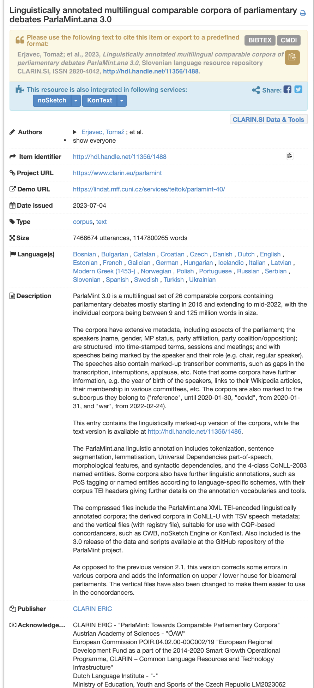

# Metadata and Controlled Vocabularies

## Slides (new)

[Download the slides here TBD](https://github.com/FAIR-by-Design-Methodology/IDCC24workshop/raw/main/resources/02%20Skills4EOSC/Skills4EOSC-IDCCworkshop_FAIR-by-Design_Methodology.pptx){:download}

## Learning objectives

Upon completing this module the learner should be able to:

- understand the need for metadata of learning resources 
- understand the concept of controlled vocabularies
- define the syllabus and the learning objective of a learning unit

## Metadata and Metadata Schema

Metadata is one of the key ingredients to making learning resources findable, accessible, and reusable. In essence, metadata consists of structured information that describes, explains and locates a resource.

The main purpose of the (meta)data about the learning resource is to enable cataloguing and discovery by providing a standard means to report on:

- WHO created the resource
- WHAT is the content of the resource
- WHEN was the resource created
- WHERE is the location of the resource
- WHY the data was resource

Example metadata for a language dataset

Using this information a learner or instructor should be able to:

- Search and retrieve the information about a learning resource 
- Determine if the learning resource meets certain learning requirements
- Discover how to acquire and use the learning resource

### RDA Minimal Metadata for Learning Resources

The [RDA Education And Training On Handling Of Research Data Interest Group](https://www.rd-alliance.org/groups/education-and-training-handling-research-data.html) has defined a [minimal metadata set for learning resources](https://zenodo.org/record/6769695#.YrrP9-xBybQ) that has become a de facto standard for describing FAIR learning materials.

The following table describes the minimal metadata set elements and their definitions:

| **Element Name** | **Definition** |
|---|---|
| Title | The human readable name of the resource. |
| Abstract / Description | A brief synopsis about or description of the learning resource |
| Author(s) | Name of entity(ies) authoring the resource |
| Primary Language | Language in which the resource was originally published or made available |
| Keyword(s) | Keywords or tags used to describe the resource |
| License | A license document that applies to this content, typically indicated by URL |
| Version Date | Version date for the most recently published or broadcast resource |
| URL to Resource | URL that resolves to the learning resource or to a "landing page" for the resource that contains important contextual information  including the direct resolvable link to the resource, if applicable. |
| Resource URL Type | Designation of the identifier scheme  used for the resource URL, e.g., DOI, ARK, Handle |
| Target Group (Audience) | Principal users(s) for which the resource was designed |
| Learning Resource Type | The predominant type or kind that characterizes the learning resource |
| Learning Outcome | Descriptions of what knowledge, skills or abilities a learner should acquire on completion of the resource |
| Access Cost | Choice stating whether or not there is a fee for use of the resource (yes, no, maybe) |
| Expertise (Skill) Level | Target skill level in the topic being taught; example values include beginner, intermediate, advanced |

This table is taken from [RDA Minimal Metadata for Learning Resources](https://doi.org/10.15497/RDA00073) by Hoebelheinrich, Nancy J; Biernacka, Katarzyna; Brazas, Michelle; Castro, Leyla Jael; Fiore, Nicola; Hellström, Margareta; Lazzeri, Emma; Leenarts, Ellen; Martinez Lavanchy, Paula Maria; Newbold, Elizabeth; Nurnberger, Amy; Plomp, Esther; Vaira, Lucia; van Gelder, Celia W G; Whyte, Angus licensed under the [CC BY 4.0 license](https://creativecommons.org/licenses/by/4.0/legalcode).

These elements need to be standardized so that they are useful when used in practice. This is done by defining a metadata schema that describes the structure of the metadata elements. The metadata schema defines the standards for describing the metadata elements.

The metadata schema for learning resources that also defines the type of each element, the allowed values, and constraints is available on the RDA website: [RDA Minimal Metadata for Learning Resources Professional and Informal Education Examples](https://www.rd-alliance.org/system/files/Copy%20of%20Examples%20for%20Professional%20and%20Informal%20Education.pdf)

### Controlled Vocabularies

Some of the fields in the proposed RDA metadata schema are based on fixed or suggested controlled vocabularies (CV). The use of controlled vocabularies is to help humans and machines categorize the information while helping to reduce duplication and errors. 

In essence, controlled vocabularies should be used for any metadata elements with predefined value(s), where in the vocabulary is presented as a list of prescribed items. 

Such examples are 

- Access Cost with possible values of Y, N and Maybe
- Primary Language that can be a two letter code from the [ISO 639-1:2002 codeset](https://en.wikipedia.org/wiki/List_of_ISO_639-1_codes)

In the Skills4EOSC project, a specific example of using controlled vocabularies are different lists of OS Skills Terms

- t4FS: 223 'data stewardship activity' terms
- CSCCE  Glossary: 45 terms listed according to 5 dimensions, selecting those included in 'skills wheel' for scientific community managers
- [ResearchComp](https://research-and-innovation.ec.europa.eu/system/files/2023-04/ec_rtd_research-competence-presentation.pdf)

Note that in many cases controlled vocabularies are suggested, but at this stage they are not strictly defined.

Later on during this training, you will learn how and where to define the metadata for your learning resources.

## Syllabus 

Once you have identified your learning concepts, the next step is to sequence them into an instructional sequence (agenda). This instructional sequence will become your blueprint for the organisation of the learning materials and the definition of the syllabus.

In essence the blueprint takes the input from the creative concept map and organizes it into a more formal outline. Formally, we call this learning materials outline syllabus. Each syllabus should provide information regarding a number of elements (including the ones defined in the step 1 of the backward instructional design):

- clear, descriptive **title** 
- description of the **purpose** or goal 
- **target audience**
- **prerequisites**
- **duration**
- **learning objectives**
- **agenda** (instructional sequence)
- **resources and materials**
- **certification** information

Remember that:

- The syllabus can present a higher level sequence outline, that can be later broken down into smaller subtopics if necessary.
- The topics sequence should be defined so that the concepts introduced early help with the ones encountered later. 
- The defined agenda should not be very rigid thus preventing changing the sequence of topics or adding or deleting topics at a later stage.
- The syllabus is sent to the learners and should provide them with all necessary information to help them decide if they want to follow the training related to the learning materials.

### Syllabus Elements

Within this training we recommend the development of a training syllabus that consists of two groups of information:

- typical syllabus information
- additional information related to the RDA minimal metadata schema

The following is a **list of all required syllabus fields**:

- Clear descriptive Title of the training 
- Type (Course/Workshop/Webinar)
- Date/Time: when it will be offered (available from date if it is self-paced)
- Location - where it will be available
    - physical location
    - URL link to resources (and virtual room if online) should lead to the learning Skills4EOSC platform
- Training Description - what is the main goal/purpose of this training
- Target audience: target audience description 
- Expertise Level / Skill Level: Beginner / Intermediate / Advanced
- Primary Language: English
- Access Cost: N 
- Prerequisites - if any
- Duration - total training duration
- Training objectives - list of specific training objectives
- Keywords - Keywords or tags used to describe the training
- Agenda: Training Schedule - Training Structure  (time, topic)
- Resources and Materials - list with locations of available/required resources for the training
- Certification Information - if any
- Author(s) - Comma separated List of people involved in preparing the training (Name Surname)
- Trainer(s) - Comma separated list of people involved in delivering the training (Name Surname ORCID logo link)
- Contact information - how to reach out to training organizers
- License
- PID
- Accessibility Mission

As syllabus is one of the required documents for the FAIR-by-Design learning materials, you must ensure that your syllabus contains **all elements** provided in this section. Only in this way you will ensure that your learning materials contain all necessary metadata information together with the traditional syllabus information that is provided.

### Defining learning objectives

Learning objectives should describe what new knowledge and skills will be obtained in a specific, measurable, attainable, relevant and time-bound (SMART) way. 

The learning objectives are used to organize specific topics or individual learning activities so that the learner can most effectively achieve the overall learning outcome.

To ensure standardization and wide understanding of the learning objective, it is best practice to define the learning objectives using a well-known taxonomy such as the [Bloom’s taxonomy](https://cmapspublic2.ihmc.us/rid=1Q2PTM7HL-26LTFBX-9YN8/Krathwohl%202002.pdf). 

The Bloom's Taxonomy is a classification of the different objectives and skills that educators set for their students (learning outcomes). The cognitive domain categorizes the human learning process into 6 hierarchical levels: Remember, Understand, Apply, Analyze, Evaluate, and Create. 

"[Bloom's Revised Taxonomy](https://www.flickr.com/photos/vandycft/29428436431)" by [Vanderbilt University Center for Teaching](https://cft.vanderbilt.edu) licensed under the terms of the [CC-BY-2.0](https://creativecommons.org/licenses/by/2.0/).

When defining learning objectives using the Bloom's taxonomy, correct verbs should be used for each objective based on the level the learners needs to achieve. For these purposes the example verbs provided in the image can be used.

[Bloom's taxonomy](https://en.wikipedia.org/wiki/Bloom%27s_taxonomy#/media/File:Bloom%E2%80%99s_Taxonomy_Verbs.png) by [Fractus Learning](https://www.fractuslearning.com/). (2023, July 10). In [Wikipedia](https://en.wikipedia.org/wiki/Bloom%27s_taxonomy) licensed under the terms of [CC BY-SA 4.0](https://creativecommons.org/licenses/by/4.0/).  

This approach will significantly improve the findability of the produced resources, as well as the potential reuse of individual learning objects in different aggregations.

The number of learning objectives depends on the aggregation level of the learning resource that is being developed. 

## Summary

Using metadata has crucial importance when producing learning resources that need to be findable and reusable. Skills4EOSC supports the usage of RDA Minimal Metadata for Learning Resources. In addition the usage of controlled vocabularies helps in  standardizing terms for consistency. A syllabus organizes learning concepts into a structured instructional sequence, and learning objectives should be defined clearly using frameworks like Bloom's Taxonomy to ensure they are specific and measurable.

## Suggested Reading

- [Skills4EOSC FAIR-by-Design Methodology for Learning Materials Development](https://zenodo.org/records/8419242)
- [Skills4EOSC FAIR-by-Design Microlearning Stage 1](https://fair-by-design-methodology.github.io/microlearning/latest/01%20Prepare/prepare/)
- [Skills4EOSC FAIR-by-Design Methodology Describing learning materials](https://fair-by-design-methodology.github.io/FAIR-by-Design_Book/3%20-%20Learning%20materials%20description%20and%20modelling/31-Describing_learning_materials/)
- [Skills4EOSC FAIR-by-Design Methodology Design stage](https://fair-by-design-methodology.github.io/FAIR-by-Design_Book/4%20-%20FAIR-by-design%20learning%20materials%20creation/4.1%20-%20Workflow%20stages%20description/413-design/)
