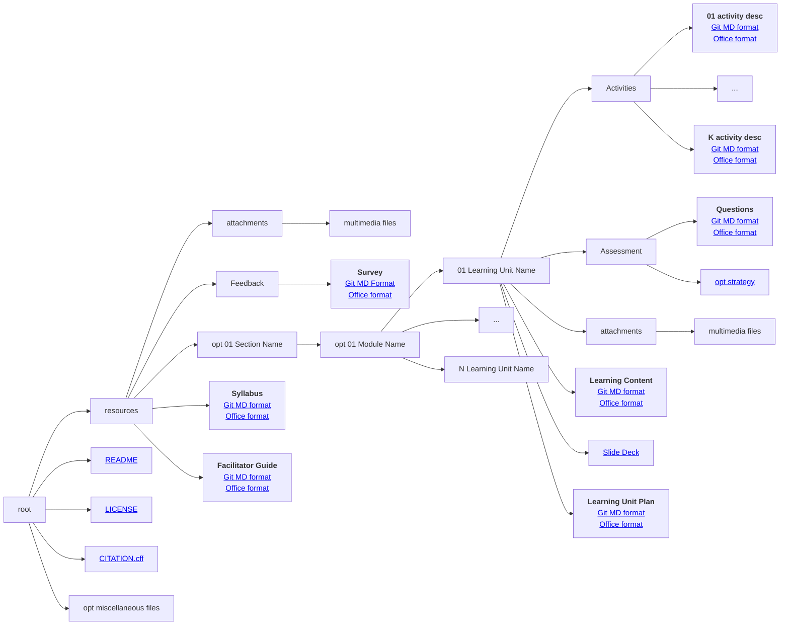

# Facilitator Kit

## Slides

[Download the slides here](https://github.com/FAIR-by-Design-Methodology/CLARIN-Training/blob/main/resources/1st%20Session/05%20Facilitator%20kit/Facilitator%20kit.pptx){:download}

## Learning objectives

Upon completing this module the learner should be able to:

- define the elements of the learning unit plan 
- develop the instructors kit

## The Instructor Kit

!!! info "Syllabus is ready" 

    You should by now have the first draft of your <a href='https://fair-by-design-methodology.github.io/FAIR-by-Design_ToT/latest/Stage%203%20–%20Design/04-Conceptualisation/04-Conceptualisation/'>syllabus</a>. It contains all the fields from the RDA min metadata set plus the high level topics covered by the learning material.

The main goal of the instructor kit is to support the trainers and instructors in the delivery of the learning materials.
It is also essential for high quality reusability of the learning materials by other trainers and/or instructional designers. 

The **complete instructor kit** consists of learning materials that are developed and used to support the learning process, but are not directly visible by learners. These include the following items:

- learning unit plan
- activity details
- quiz question banks
- quiz strategies
- facilitation guide
- feedback questions

### Structure is everything

- <i class="fa fa-cogs" aria-hidden="true"></i> Create an intuitive logical organisation of all learning materials. 
- <i class="fa fa-cubes" aria-hidden="true"></i> The goal is for other people to easily reuse a single item (plan, activity, unit, assessment, ...).
- <i class="fa fa-sitemap" aria-hidden="true"></i> Use a hierarchical structure to combine learning units into larger compositions.

!!! example "How to organise the files"

    The diagram shows how to organise all files in folders and subfolders. Click on the links to discover and use pre-prepared templates. To download the files, use the "Download raw file" button at the upper right corner [![[Download.png]]]

??? info "Don't worry, we got you covered with templates"

    All templates are readily available for use in the specialised [templates repository](https://github.com/FAIR-by-Design-Methodology/templates). See the detailed training on how to use it step by step.

### Learning Unit Plan

To ensure rich learning experience it is imperative to develop a learning unit plan. This document incorporates all aspects that should lead to a high quality learning experience as it defines the plan on how to use teaching methods and the learning content together with activities to achieve the defined learning objectives. 

Note that an effective lesson plan for online trainees may not be the same to the one for traditional workshop settings.

Formally, a unit plan refers to a detailed step-by-step guide for a trainer to understand what materials to give to students and how to provide them so students would accomplish their learning goals.

There may be different detail levels of the learning unit plan:

- Detailed: a detailed plan that includes what will be the trainer step-by-step plan and learning activities.
- Semi-detailed: a semi-detailed plan is less complex and offers a general game plan of what will be covered in the unit.

It is recommended that you follow the **Hunter's model** for developing a learning unit plan:

1. **Set Learning Objectives** ... what is the goal
2. **Identify Needs** ... how to get there 
3. **Plan** ... share the agenda
4. **Hook** ... why is the content important
5. **Instruct** ... watch how I do it
6. **Practise** ... you help me do it, I'll watch you do it
7. **Wrap-Up** ... foster retention and reinforcement
8. **Evaluate** ... monitor progress
9. **Reflect** ... how did it go?

[Read more about the Hunter Model](https://www.csun.edu/sites/default/files/Holle-Lesson-Planning.pdf)

#### Learning Unit Plan Development

In a nutshell, the **required information** that you need to provide in your learning plan is:

- Unit Name
- Purpose of the unit
- Location
- Duration
- Number of attendees
- Learning objectives
- Plan including topic, duration, key points, teaching methods, activities and resources
- Assessment
- Certification
- Reflection 

Remember that although some parts of this information may seem repetitive with the overall syllabus, the plan is much more detailed and the repetition provides the much needed context for reuse. 

#### Learning Content

Once you have a plan, it is time to start developing the learning content. Remember to design the content so that it appeals learners with different modalities (verbal, audio, read/write, kinesthetic) including different multimedia. 

The learners notebook is the main learning content that you are aiming to introduce the learners to. The content of each **learning unit notebook** should include:

- brief introduction
- learning objectives
- target audience
- duration
- prerequisites
- learning tools
- content
- summary
- suggested reading

Again, although some items may seem repetitive compared to the syllabus, bear in mind that this is done in order to improve reusability. In this way the learning unit can be reused as a stand alone package. 

Remember to add different types of media to the content, supporting an integrated multi-modal approach.

For pure self-based learning the complete notebook should be enough to present all of the learning content in one place.

??? tip "Slides"
	
	For trainer led environments, usually a slide deck is also necessary so that the trainer can lead the trainees across the learning content and work with them through the activities. 
	
	The slide deck should follow the stages of the HUNTER model.

??? question "What about instructor notes?"

    Need to be detailed enough so that anyone can reuse the slides properly. Don't put them in the slide deck. This is what the learning content file is for.

### Activity description

All activities that are planned to be performed with or by the learners as part of the learning unit plan should be described in enough details so that they can be executed by any trainer or facilitator no matter if they are part of the original instructional design team or not. They could be only tasked with training implementation, or they could be simply reusing the learning material.

In addition, this additional documentation related to activity description can serve as a personal reminder long after the training has been completed and it allows for keeping notes on how the activity was implemented as well as any external community feedback.

Based on the best practices, **each activity** should be described in a separate document that contains:

- activity name
- short description
- duration
- number of people it can be performed with
- goal
- materials
- instructions
- tips and tricks
- related sources
- comments

This [example of an activity description document](./attachments/CombiningLicenses.html) related to one of the activities offered in this training can help you visualise the type of information that needs to be included for each activity.

A set of well described and reusable activities can be found at the [Session lab website](https://www.sessionlab.com/library/).
Another source of activities is [25 activities for making lecture-based training active](https://www.businesstrainingworks.com/training-resource/25-activities-for-making-lecture-based-training-active/).

### Assessment

Thinking about how you can assess the learners obtained knowledge is part of step 2 of the backward instructional design process. Traditionally, there are many different types of assessments that can be performed, but the most typically used in professional training and certification is the quiz form.

In general, quizzes can be used in a large variety of settings, providing opportunities for reflection, knowledge improvement with feedback or assessment. Although they can be setup as formative (after each learning unit) or summative (one exam quiz at the end), from the FAIR-by-design perspective, it is recommended that at least the questions that form the quiz are setup in a formative way, meaning each learning unit comes with a set of questions that are related to that particular learning unit.

In this way, it is up to the instructor to setup the assessment: is it going to be multiple quizzes throughout or is it going to be one in the end. 

When designing the quiz questions one should go back to the Bloom's taxonomy introduced . This time however, you are interested in what type of quiz question can be used to assess the knowledge of a different level of the cognitive domain. This is presented in the table below.

|                | **T/F** | **MC** | **MS** | **LA** | **SA** | **FIB** | **MAT** | **ORD** |
|----------------|---------|--------|--------|--------|--------|---------|---------|---------|
| **Create**     |         |        |        | X      |        |         |         |         |
| **Evaluate**   |         |        | X      | X      |        |         | X       | X       |
| **Analyze**    |         | X      | X      | X      |        |         |         |         |
| **Apply**      |         | X      |        | X      |        | X       | X       | X       |
| **Understand** |         | X      | X      |        | X      | X       |         |         |
| **Remember**   | X       | X      | X      |        | X      | X       |         |         |

where

- T/F - True/False
- MC - multiple choice
- MS - multi-select
- LA - long answer
- SA - short answer
- FIB - fill in the blank
- MAT - Matching
- ORD - Ordering

#### Assessment Strategy

Once you have defined your quiz questions, the next step is to define the quiz strategy.

This strategy can be defined 

- separately for each quiz 
- as a common strategy for all formative quizzes, or 
- can be one strategy for the summative final exam

In the first case, a separate strategy document needs to be developed for each learning unit, while for the later two options (recommended) the quiz strategy can be described in the main facilitation guide document (see next learning unit for more details).

If each learning unit has its own quiz strategy then it should be provided together with the learning unit. 

### Learning Unit Structure

To summarise, a **complete learning unit** consists of several parts:

- learning unit plan
- learning unit content
- optional slide deck or similar type of instructional material
- activities description
- assessment quiz and strategy

### Facilitation Guide

As the syllabus represents the learner's view of the learning materials, the facilitation guide is a document that represents the trainers view and aims to enable a smooth and efficient training. Thus the guide aims to help with the general activities regarding the organisation of the training, what needs to be done before, during and after the training, how to setup the training environment, prepare any props and materials, etc. 

A well-defined **facilitation guide** should include the following elements:

- what to do 
	- before
	- during
	- after the training
- where are all of the materials that should be used during the training
    - digital materials location
    - physical resources and equipment needed
        - e.g. projector
        - e.g. activity resources such as card decks
        - etc.
- how to prepare the materials beforehand
    - e.g. something needs to be written on flip charts
- how to prepare the learning environment
    - room layout and any other specifics (e.g. name tags, sign-in sheet, etc.)
    - in case of an online training this includes preparation of the virtual room, providing access, sending out or publishing reading materials, etc.

In the case of a summative or common quiz strategy it can contain this information as well.

For best visibility, the guide should also contain shortcuts to all activities planned. However, any specific details and notes should be available in the learning unit plan.

??? info "Available facilitation guide kit"

    The <a href='https://fair-by-design-methodology.github.io/FAIR-by-Design_ToT/latest/Stage%203%20–%20Design/07-Facilitation/07-Facilitation/'> facilitation guide </a> should help prepare for the actual training. If you don't want to develop your own, use something that is already available such as the [TRIPLE project TRAINING TOOLKIT](https://project.gotriple.eu/project-deliverables/triple-training-toolkit/).

### Feedback 

At the end of the learning process you should gather feedback from the learners so that they can provide feedback on what worked well and what should be improved in the training and learning materials. For these purposes a set of feedback questions should be drafted. The feedback can be gathered by enabling the learners to answer the questions using different modalities:

- physically by filling out a feedback sheet
- digitally using a feedback form created on the learning platform or using some other survey system

??? info "Available feedback form"

    The <a href='https://fair-by-design-methodology.github.io/FAIR-by-Design_ToT/latest/Stage%203%20–%20Design/07-Facilitation/07-Facilitation/'> feedback form template </a> is ready to be used as is. All you need to do is change the name of the training. It should be shared with training participants after the training, to gather quantitative and qualitative feedback.

## Summary

Creating an effective learning experience begins with clearly defined learning objectives, which serve as a roadmap for what students should achieve by the end of the course. To support instructors, an Instructor Kit provides all necessary resources and tools to guide the teaching process. However, at the heart of any course, structure is critical—ensuring that learning flows logically and builds on prior knowledge.

Central to this is the Learning Unit Plan, a detailed outline of each module, specifying content, activities, and assessments. The process of Learning Unit Plan Development involves designing units that align with the learning objectives, creating a seamless progression from one concept to the next. These units contain curated learning content, which may range from lectures and readings to videos or interactive materials.

Equally important are the activity details, where learners engage with the material through discussions, exercises, or hands-on tasks that deepen their understanding. The course’s assessment mechanisms, including both formative and summative strategies, help measure progress and reinforce learning. An effective assessment strategy ensures that learners are evaluated fairly and that the results align with the course’s objectives.

Lastly, a facilitation guide is essential for instructors, offering clear guidelines on how to manage the learning environment, deliver content, and support students. Feedback questions provide an opportunity to gather insights from learners, ensuring continuous improvement in both content and delivery.

## Suggested Reading

- [Skills4EOSC FAIR-by-Design Methodology for Learning Materials Development](https://zenodo.org/records/8419242)
- [Skills4EOSC FAIR-by-Design Microlearning Stage 1 Prepare](https://fair-by-design-methodology.github.io/microlearning/latest/01%20Prepare/prepare/)
- [Skills4EOSC FAIR-by-Design Methodology Stage 2 Design](https://fair-by-design-methodology.github.io/FAIR-by-Design_Book/4%20-%20FAIR-by-design%20learning%20materials%20creation/4.1%20-%20Workflow%20stages%20description/413-design/)

