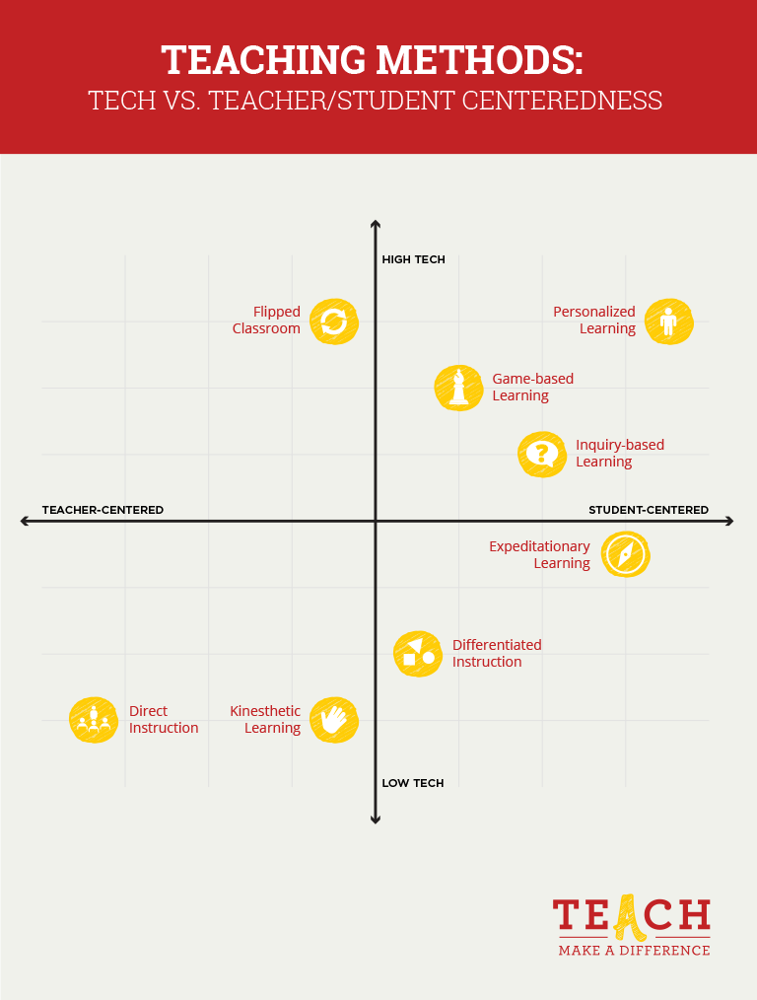
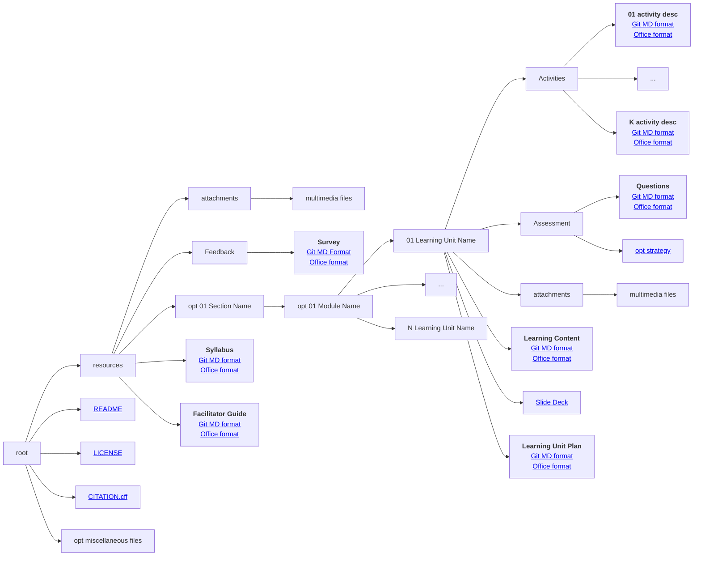

# Facilitator Kit

## Slides

[Download the slides here TBD](https://github.com/FAIR-by-Design-Methodology/IDCC24workshop/raw/main/resources/02%20Skills4EOSC/Skills4EOSC-IDCCworkshop_FAIR-by-Design_Methodology.pptx){:download}

## Learning Unit Plan

To ensure rich learning experience it is imperative to develop a learning unit plan. This document incorporates all aspects that should lead to a high quality learning experience as it defines the plan on how to use teaching methods and the learning content together with activities to achieve the defined learning objectives. 

Note that an effective lesson plan for online trainees may not be the same to the one for traditional workshop settings.

Formally, a unit plan refers to a detailed step-by-step guide for a trainer to understand what materials to give to students and how to provide them so students would accomplish their learning goals.

There may be different detail levels of the learning unit plan:

- Detailed: a detailed plan that includes what will be the trainer step-by-step plan and learning activities.
- Semi-detailed: a semi-detailed plan is less complex and offers a general game plan of what will be covered in the unit.

It is recommended that you follow the **Hunter's model** for developing a learning unit plan:

1. Set the learning objectives
    - These are lower level learning objectives for the particular learning unit. Combining all learning objectives from all units should lead to the high level learning objectives defined in the syllabus.
	- Ensure these are clear and follow a logical order that is easy to understand and help identify meaningful concepts and ideas.
	- Follow the Bloom's taxonomy again.
2. Identify the needs of the target audience
    - Make sure you are prepared to help learners along the way
3. Plan your training material
    - Create a list of all the resources. From stationary like a pen or paper to technology equipment like laptops, software, or gamified learning tools like apps or any website, all these can help you get the most out of what you intend to do.
4. Present the outline of the unit - the Hook
    - Throughout the training, the goal is to keep learners engaged. 
	- An outline can help them develop a context around the subject, letting them know what is coming next, and encourage them to relate to the learning materials at hand. 
	- Don’t forget to draw relevant examples of events or develop creative activities that spark interest and attention.
5. Instruct the lesson
    - Follow the order and present the resources you need, but also make sure to involve the learners in this process. 
	- You may use as much multimedia as you want to facilitate engagement and give a wealth of examples learners can relate to easily –  most important is to present the information in a meaningful way.
6. Provide time to practice
    - Once you finish your instruction, it’s the learners’ turn to take the lead. 
	- Ask them to show what they have learned through practice. 
	- For an example start with a guided practice – allowing learners to make sense of the information they have just received. 
	- Then you can follow up with a collaborative process – let them work in groups to explore main concepts. 
	- Finish with independent practice – giving each time to work on their own through an assignment.
7. Wrap-up
    - Do an overview of what has been discussed and what has been learned. 
	- Ask learners to tell you the key takeaways, identifying main ideas and conclusions. 
	- Give a preview of the next unit to prepare them.
8. Evaluate
    - Determine whether the learning objectives have been met, and ensure that learners understood what you taught through a small quiz, test, or exam.
9. Reflection
    - Did everything do as planned or something needs to be improved?

### Learning Unit Plan Development

In a nutshell, the **required information** that you need to provide in your learning plan is:

- Unit Name
- Purpose of the unit
- Location
- Duration
- Number of attendees
- Learning objectives
- Plan including topic, duration, key points, teaching methods, activities and resources
- Assessment
- Certification
- Reflection 

Remember that although some parts of this information may seem repetitive with the overall syllabus, the plan is much more detailed and the repetition provides the much needed context for reuse. 

### Method(s)

When developing the plan you will need to think about the teaching methods that will be used during the training. 

One or more preferred teaching methods should be utilised during the training for maximum effect. Some typical teaching methods that can be employed are presented in the following image

Image by [edX](https://www.edx.org) from [teach.com](https://teach.com/what/teachers-know/teaching-methods/), &copy; 2U

### Activity

Analyse the [Example Learning Plan](./attachments/02-Preparing%20FAIR%20Learning%20Objects_plan.html) that has been created for one of the learning units that are part of this training. 

Are you able to prepape a learning unit plan for the identified units in your Open Science training?

Note that the development process is iterative. As you develop the content later on you might come back to the plan and make changes. Don't forget that larger changes might also affect the syllabus. 

## Learning Content

Once you have a plan, it is time to start developing the learning content. Remember to design the content so that it appeals learners with different modalities (verbal, audio, read/write, kinesthetic) including different multimedia. 

The learners notebook is the main learning content that you are aiming to introduce the learners to. The content of each **learning unit notebook** should include:

- brief introduction
- learning objectives
- target audience
- duration
- prerequisites
- learning tools
- content
- summary
- suggested reading

Again, although some items may seem repetitive compared to the syllabus, bear in mind that this is done in order to improve reusability. In this way the learning unit can be reused as a stand alone package. 

Remember to add different types of media to the content, supporting an integrated multi-modal approach.

For pure self-based learning the complete notebook should be enough to present all of the learning content in one place.

However, for trainer led environments, usually a slide deck is also necessary so that the trainer can lead the trainees across the learning content and work with them through the activities. 

The **slide deck should follow the stages of the HUNTER model**:

- title slide
- introduction (trainers and trainees)
- Housekeeping information
- Learning Objectives
- Training Outline
- Training Topic
	- information
	- example
	- guided activity
- Wrap up
	- key takeaways
	- final Q&A
	- assessment information
	- feedback gathering

## Activity details

All activities that are planned to be performed with or by the learners as part of the learning unit plan should be described in enough details so that they can be executed by any trainer or facilitator no matter if they are part of the original instructional design team or not. They could be only tasked with training implementation, or they could be simply reusing the learning material.

In addition, this additional documentation related to activity description can serve as a personal reminder long after the training has been completed and it allows for keeping notes on how the activity was implemented as well as any external community feedback.

Based on the best practices, **each activity** should be described in a separate document that contains:

- activity name
- short description
- duration
- number of people it can be performed with
- goal
- materials
- instructions
- tips and tricks
- related sources
- comments

This [example of an activity description document](./attachments/CombiningLicenses.html) related to one of the activities offered in this training can help you visualise the type of information that needs to be included for each activity.

A set of well described and reusable activities can be found at the [Session lab website](https://www.sessionlab.com/library/).
Another source of activities is [25 activities for making lecture-based training active](https://www.businesstrainingworks.com/training-resource/25-activities-for-making-lecture-based-training-active/).

## Assessment

Thinking about how you can assess the learners obtained knowledge is part of step 2 of the backward instructional design process. Traditionally, there are many different types of assessments that can be performed, but the most typically used in professional training and certification is the quiz form.

In general, quizzes can be used in a large variety of settings, providing opportunities for reflection, knowledge improvement with feedback or assessment. Although they can be setup as formative (after each learning unit) or summative (one exam quiz at the end), from the FAIR-by-design perspective, it is recommended that at least the questions that form the quiz are setup in a formative way, meaning each learning unit comes with a set of questions that are related to that particular learning unit.

In this way, it is up to the instructor to setup the assessment: is it going to be multiple quizzes throughout or is it going to be one in the end. 

When designing the quiz questions one should go back to the Bloom's taxonomy introduced . This time however, you are interested in what type of quiz question can be used to assess the knowledge of a different level of the cognitive domain. This is presented in the table below.

|                | **T/F** | **MC** | **MS** | **LA** | **SA** | **FIB** | **MAT** | **ORD** |
|----------------|---------|--------|--------|--------|--------|---------|---------|---------|
| **Create**     |         |        |        | X      |        |         |         |         |
| **Evaluate**   |         |        | X      | X      |        |         | X       | X       |
| **Analyze**    |         | X      | X      | X      |        |         |         |         |
| **Apply**      |         | X      |        | X      |        | X       | X       | X       |
| **Understand** |         | X      | X      |        | X      | X       |         |         |
| **Remember**   | X       | X      | X      |        | X      | X       |         |         |

where

- T/F - True/False
- MC - multiple choice
- MS - multi-select
- LA - long answer
- SA - short answer
- FIB - fill in the blank
- MAT - Matching
- ORD - Ordering

The easiest way to define the quiz questions in a reusable format is to use the GIFT quiz format that can then be imported in the Skills4EOSC learning platform (the other way around is also possible, export the questions created on the platform in GIFT for others to reuse).

The provided [Quiz GIFT Template](./attachments/quiz_gift_template.txt) contains examples of the different types of questions. 

Detailed instructions on how to write quiz questions in the GIFT format can be found on the Moodle site: [GIFT format](https://docs.moodle.org/402/en/GIFT_format).

You can use the [GIFT Question Editor](https://fuhrmanator.github.io/GIFT-grammar-PEG.js/editor/editor.html) to validate or generate your own GIFT formatted quiz questions.

### Create a quiz

Try to create a quiz that has at least 3 different questions of different types for one of the learning units of your Open Science course. Validate your quiz using the [GIFT Question Editor](https://fuhrmanator.github.io/GIFT-grammar-PEG.js/editor/editor.html).

### Assessment Strategy

Once you have defined your quiz questions, the next step is to define the quiz strategy.

This strategy can be defined 

- separately for each quiz 
- as a common strategy for all formative quizzes, or 
- can be one strategy for the summative final exam

In the first case, a separate strategy document needs to be developed for each learning unit, while for the later two options (recommended) the quiz strategy can be described in the main facilitation guide document (see next learning unit for more details).

If each learning unit has its own quiz strategy then it should be provided together with the learning unit. 

The **assessment strategy** needs to describe the following items:

- how many questions should be used from the questions pool
- is there any weight that should be given to the questions
- questions order (random or specific)
- answers order
- quiz duration
- when the quiz starts and finishes
- how many times it can be taken
- grading method
- completion rules
- results publication guide

To summarise, a **complete learning unit** consists of several parts:

- learning unit plan
- learning unit content
- optional slide deck or similar type of instructional material
- activities description
- assessment quiz and strategy

Note that in the next stage, Prepare, you will train on how to create the content from scratch. At this point in the Design stage the goal is only to introduce you to the type of information that needs to be provided in each of the defined documents. 

## The Instructor Kit

The main goal of the instructor kit is to support the trainers and instructors in the delivery of the learning materials.
It is also essential for high quality reusability of the learning materials by other trainers and/or instructional designers. 

The **complete instructor kit** consists of learning materials that are developed and used to support the learning process, but are not directly visible by learners. These include the following items:

- learning unit plan
- activity details
- quiz question banks
- quiz strategies
- facilitation guide
- feedback questions

Most of the items were already introduced and discussed in [06 - Learning Unit Development](../06-Learning%20unit%20development/06-LearningUnitDevelopment.md). Here we will only focus on the last documents: the facilitation guide and the feedback questions.

### Facilitation Guide

As the syllabus represents the learner's view of the learning materials, the facilitation guide is a document that represents the trainers view and aims to enable a smooth and efficient training. Thus the guide aims to help with the general activities regarding the organisation of the training, what needs to be done before, during and after the training, how to setup the training environment, prepare any props and materials, etc. 

A well-defined **facilitation guide** should include the following elements:

- what to do 
	- before
	- during
	- after the training
- where are all of the materials that should be used during the training
    - digital materials location
    - physical resources and equipment needed
        - e.g. projector
        - e.g. activity resources such as card decks
        - etc.
- how to prepare the materials beforehand
    - e.g. something needs to be written on flip charts
- how to prepare the learning environment
    - room layout and any other specifics (e.g. name tags, sign-in sheet, etc.)
    - in case of an online training this includes preparation of the virtual room, providing access, sending out or publishing reading materials, etc.

In the case of a summative or common quiz strategy it can contain this information as well.

For best visibility, the guide should also contain shortcuts to all activities planned. However, any specific details and notes should be available in the learning unit plan.

### Feedback questions

At the end of the learning process you should gather feedback from the learners so that they can provide feedback on what worked well and what should be improved in the training and learning materials. For these purposes a set of feedback questions should be drafted. The feedback can be gathered by enabling the learners to answer the questions using different modalities:

- physically by filling out a feedback sheet
- digitally using a feedback form created on the learning platform or using some other survey system

An example Training Evaluation form is presented in the next subsection. A similar evaluation form can be created using the feedback tool in the Skills4EOSC platform. 

Do not forget to set the following **settings** of the defined feedback used for training evaluation:

- availability from - to
- anonymous
- no multiple submissions
- show analysis page (for transparent review of the results) 

#### Training Evaluation Form

In Skills4EOSC we strive to provide high quality training and continuous improve our training activities. 
To be able to achieve that your feedback is very important to us. 

Please take a moment of your time to fill out the evaluation of the [insert training title]. It will only take a minute.

##### Training rating

Overall, the training provided was

- Excellent
- Very good
- Good
- Fair
- Poor

##### Training aspects rating

Let us know what was your experience regarding different training aspects:

|                                                     | Strongly disagree | Disagree | Neutral | Agree | Strongly agree |
|-----------------------------------------------------|-------------------|----------|---------|-------|----------------|
| I achieved the learning objectives.                 |                   |          |         |       |                |
| The training was clear and easy to follow.          |                   |          |         |       |                |
| The learning materials were clear.                  |                   |          |         |       |                |
| The learning content was relevant.                  |                   |          |         |       |                |
| The time allotted for the training was well chosen. |                   |          |         |       |                |
| The trainers were well prepared.                    |                   |          |         |       |                |
| The training activities were relevant.              |                   |          |         |       |                |

##### Acquired knowledge rating
How would you rate your level of knowledge on the topic before and after the training.

|                                     | None | Newbie | Basic | Advanced | Expert |
|-------------------------------------|------|--------|-------|----------|--------|
| My skills level before the training |      |        |       |          |        |
| My skills level after the training  |      |        |       |          |        |

##### Insights

In your opinion 

- the most useful part of the training is [free text]
- the least useful part of the training is [free text]
- the training could have been improved by [free text]

## Structure is everything

- <i class="fa fa-cogs" aria-hidden="true"></i> Create an intuitive logical organisation of all learning materials. 
- <i class="fa fa-cubes" aria-hidden="true"></i> The goal is for other people to easily reuse a single item (plan, activity, unit, assessment, ...).
- <i class="fa fa-sitemap" aria-hidden="true"></i> Use a hierarchical structure to combine learning units into larger compositions.

!!! example "How to organise the files"

    The diagram shows how to organise all files in folders and subfolders. Click on the links to discover and use pre-prepared templates.

!!! info "Syllabus is ready" 

    You should by now have the first draft of your <a href='https://fair-by-design-methodology.github.io/FAIR-by-Design_ToT/latest/Stage%203%20–%20Design/04-Conceptualisation/04-Conceptualisation/'>syllabus</a>. It contains all the fields from the RDA min metadata set plus the high level topics covered by the learning material.

??? info "Available feedback form"

    The <a href='https://fair-by-design-methodology.github.io/FAIR-by-Design_ToT/latest/Stage%203%20–%20Design/07-Facilitation/07-Facilitation/'> feedback form template </a> is ready to be used as is. All you need to do is change the name of the training. It should be shared with training participants after the training, to gather quantitative and qualitative feedback.

??? info "Available facilitation guide kit"

    The <a href='https://fair-by-design-methodology.github.io/FAIR-by-Design_ToT/latest/Stage%203%20–%20Design/07-Facilitation/07-Facilitation/'> facilitation guide </a> should help prepare for the actual training. If you don't want to develop your own, use something that is already available such as the [TRIPLE project TRAINING TOOLKIT](https://project.gotriple.eu/project-deliverables/triple-training-toolkit/).

??? info "Don't worry, we got you covered with templates"

    All templates are readily available for use in the specialised [templates repository](https://github.com/FAIR-by-Design-Methodology/templates). See the detailed training on how to use it step by step.

??? question "What about instructor notes?"

    Need to be detailed enough so that anyone can reuse the slides properly. Don't put them in the slide deck. This is what the learning content file is for.

## Summary

 

## Suggested Reading

- [Skills4EOSC FAIR-by-Design Methodology for Learning Materials Development](https://zenodo.org/records/8419242)

