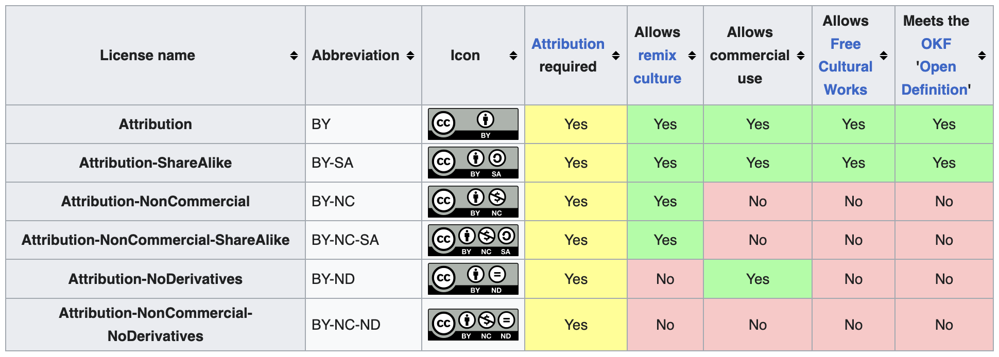

# Citing and Attribution

## Slides

[Download the slides here](https://github.com/FAIR-by-Design-Methodology/CLARIN-Training/raw/main/resources/1st%20Session/07%20Citing%20and%20attribution/Reuse_existing_materials.pptx){:download}

## Learning Objectives

- Identify permissible licenses
- Provide attribution for reused content
- Define how others should cite your work

## Intellectual Property Rights (IPR)

Intellectual property refers to the creation of intellectual activity. Intellectual Property Rights (IPR) protects the interests of the creators and owners by providing them with rights over their creation. 

For the purposes of creation of learning materials, the copyright and related rights main branches of IPR are used. They are defined to protect literary and artistic creations, performances, phonograms by defining the authors’, owners’, performers’, producers’ and broadcasters’ rights. In some cases additional IPR branches might be involved.

### Copyright

Original work can be protected by copyright law that grants the owner **exclusive right** to control certain rights such as reproduction. The copyright is owned jointly by all authors, or it may be owned by the employing institution.

Any work that you create by default makes you or your institution/employer the copyright holder of it.

**Use of copyright protected work requires permission from the owner**. Permission may not be required in the case of works licensed in the public domain and uses covered by Copyright Exceptions.

Only the copyright holder is allowed to distribute whatever is created. If you want to transfer this right to other people as well, you can do that via a license.

In absence of exceptions or limitations, one can reuse an existing work if it is licensed to the user or it is licensed to the public using a public license such as the [Creative Commons (CC) licenses](https://creativecommons.org/licenses/) or [Free-Libre / Open Source Software (FLOSS) licenses](https://dwheeler.com/essays/floss-license-slide.html).

### Licensing

>The content in this section contains material taken from:
>
>- [CC FAQ website](https://creativecommons.org/faq/#can-i-combine-material-under-different-creative-commons-licenses-in-my-work) licensed under the [CC BY 4.0 license](https://creativecommons.org/licenses/by/4.0/legalcode)
>- [Creative Commons license Wikipage](https://en.wikipedia.org/wiki/Creative_Commons_license) (2023, June 21) in Wikipedia licensed under the [Creative Commons Attribution-ShareAlike License 4.0](https://creativecommons.org/licenses/by-sa/4.0/)

A license allows you to define rights and obligations regarding the use of your work.

One of the best sources of information for licensing reusable learning materials is [Creative Commons](https://creativecommons.org/). 

There are many available [CC License options](https://creativecommons.org/about/cclicenses/) which are based on the four baseline rights.

It is **recommended** that the least restrictive **[CC BY 4.0 license](https://creativecommons.org/licenses/by/4.0/)**, requiring only that credit is given to the creator when reusing, is used when creating new learning materials. 

The ND right falls into the opposite extreme and is not recommended for FAIR learning materials licensing as it severely limits their reusability in adaptations.

Public domain licensing (CC0) is also not recommended as different rules apply in different countries.

The [CC License Chooser tool](https://creativecommons.org/choose/) helps authors share their work in a standardised way providing copyright licenses that enable sharing and reuse of the creative work under the chosen conditions. 

**To apply a license** all you have to do is indicate which CC license you are applying to your work. You should then check the terms of the chosen license and comply with the requirements therein. For an example, it is strongly recommended to include a link to the relevant CC license deed (e.g., https://creativecommons.org/licenses/by/4.0). 

Example is provided below:

>{: style="height:50px;"}

>Except where otherwise noted, content on this site is licensed under a [Commons Attribution 4.0 International License](https://creativecommons.org/licenses/by/4.0/)

??? Danger "Respect the licenses, to be respected!​"

        Materials with non-permissable licenses can be used for inspiration only. 
        
        Materials with permissable licenses should be reused based on the license rules.

### Attribution and Citing

The right to attribution is a moral right of the authors that protects the personal relationship between the author and the created work even if the creator does not own the copyright.

For work created by others that you are incorporating into your own work you want to make it easy for others to know who created what parts of the work.

In other words, acknowledgement of the reused materials through attribution is **always needed** (even if it is not a requirement of the license, such as the public domain licenses). One condition that is **required for all CC licenses** is attribution. 

The **ideal attribution** follows the TASL approach:

- **T**itle - what is the name of the work
- **A**uthor - who allows you to use the work (name and link)
- **S**ource - where can the work be found (link added to title)
- **L**icense - how can the work be used (name and link to the license)

If your work is a modification or adaptation of another work, indicate this and provide attribution to the creator of the original work. You should also include a link to the work you modified and indicate what license applies to that work.

#### Citing

A citation allows authors to provide the source of any quotations, ideas, and information that they include in their own work based on the copyrighted works of other authors. 

However, in the case of using direct quotations with citing, it is essential that the amount of information referenced is very limited. In addition, it is recommended to quote works that were already made available to the public in a lawful way and, when possible, to provide the original source and the author's name.

Depending on the country, the reproduction and communication of a protected work may be carried out for the sole purpose of illustration for teaching or scientific research, as long as the source, including the author's name, is indicated, unless this turns out to be impossible and to the extent justified by the non-commercial purpose to be achieved. 

## Plan to reuse existing material? 

-   :material-license:{ .lg .middle } __Check the license__

    ---

    The existing material is available under a CC license, but it is different than the one you plan to use for your materials...

    === "I want to reuse it as a whole"

        You can't use something that is licensed with ND (no derivatives). In this case you must follow the rules on combining and adapting CC material. [Read more...](https://creativecommons.org/faq/#combining-and-adapting-cc-material)

    === "I want to reuse a small part of it"

        No problem, you can reuse any existing CC licensed material in your learning materials as long as the reused portion is used as a showcase or to make a specific point and it is not the core of your work. If the work is licensed with ND, do not modify it while reusing.

    [:octicons-arrow-right-24: Go to CC licensing FAQ](https://creativecommons.org/faq/#before-using-cc-licensed-material)

-   :material-card-account-details-outline:{ .lg .middle } __Attribute__

    ---

    All CC licenses require that you attribute the author, and this rule is recommended even if the license is public domain CC-0.

    If the work you are reusing has a copyright notice ("© some text") you need to reproduce it while you credit the work.

    You should also be able to remove attribution upon request.

    === "Use the authors recommended attribution"

        If the original author has provided a cite-as information, use it to attribute the work.

    === "Use TASL"

        Provide the Title, Author, Source and License of the work that you are reusing. 
        
        Source is the URL to the original work.

        If there is a URL to the author personal pages, provide it together with the name.

        Provide the name of the license and a URL to the license. 
    
    === "Examples"
        > Examples are taken from [Best Practices for Creative Commons attributions - how to attribute works you reuse under a Creative Commons license](https://www.newmediarights.org/guide/how_to/creative_commons/best_practices_creative_commons_attributions) submitted by [New Media Rights](https://www.newmediarights.org/) available under a [CC BY-NC 3.0 US DEED](https://creativecommons.org/licenses/by-nc/3.0/us/)

        - Webpage/Blog - Title (with link to original work), author (or username) (with link to author's website), and license (with link).

            > [Undercover Vampire Policeman](https://chriszabriskie.bandcamp.com/album/undercover-vampire-policeman) by [Chris Zabriskie](https://chriszabriskie.bandcamp.com/), available under a [Creative Commons Attribution 4.0 License](http://creativecommons.org/licenses/by/4.0/)

        - Book – Title, author, license written somewhere near the title and author if it’s a hard copy or if it’s an online book you should include a link to the licensed terms.

            > [From Dust to Digital: Ten Years of the Endangered Archives Programme](https://books.google.com/books?id=ImO3BgAAQBAJ&pg=PR4&dq=creative+commons+4.0&hl=en&sa=X&ved=0CEoQ6AEwCGoVChMIspCXhPPxxgIVSF0eCh27NA5X#v=onepage&q=creative%20commons%204.0&f=false) by Maja Kominko under a Creative Commons Attribution Non-commercial Non-Derivative 4.0 International license (CC BY-NC-ND 4.0)

        - Online Video - Title, author, license written into credits at end of video.  Ideally make the text clickable to the original work.  Put links to the original work and the license terms in the information section for the particular work (i.e. on the right in YouTube).

            > [http://www.youtube.com/watch?v=fDbbdeIXO0w#t=3m0s](http://www.youtube.com/watch?v=fDbbdeIXO0w#t=3m0s)

        - Podcast/Audio - Title, author, license read at the end of the entire work.
            > [“Je Suis Rick Springfield”](http://www.jonathancoulton.com/wiki/Je_Suis_Rick_Springfield) from the album [Artificial Heart](http://www.jonathancoulton.com/wiki/Artificial_Heart_(album)), by Jonathan Coulton, used under a [Creative Commons Attribution-Noncommercial 3.0 Unported License](http://creativecommons.org/licenses/by-nc/3.0/)

        - Photo/Drawing/Illustration – Title, author, license (with link online) or in close proximity to the tangible work (either in the border or directly on the work, if applicable).

            > “[Comcast protest](http://www.flickr.com/photos/ari/8503459/in/set-214952/)” by Flikr user [Steve Rhodes](http://www.flickr.com/photos/ari/) used under [Creative Commons Attribution 2.0 license](http://creativecommons.org/licenses/by/2.0/deed.en)

    [:octicons-arrow-right-24: How to handle attribution?](https://courses.lumenlearning.com/suny-oerguide/chapter/how-to-handle-attribution/)

## Defining How to cite

Citation files are plain text files with human- and machine-readable citation information that tells others how to cite or attribute your work.

There is a an [open source project that defines the Citation File Format (CFF) in a CITATION.cff file](https://citation-file-format.github.io/) so that there is a structured, uniform way of decribing how others should cite your work. CITATION.cff is written in a YAML format and has controlled vocabularies for most of the supported fields. 

The purpose of this file is to provide information on how the materials (Git repository) should be cited. Its content, among other things, also controls the text shown when the Cite this repository button is clicked on the right hand side of a GitHub repository's homepage. 

### Create your own citation file

The citation file is a specific file wherein you need to provide the correct information so that it can be correctly processed. The following steps outline the procedure when using the FAIR-by-Design templates repository.

1. In the templates GitHub repository navigate to the [citation file](https://github.com/FAIR-by-Design-Methodology/templates/blob/main/CITATION.cff)
2. Copy the whole content of the file
3. In another browser tab, navigate to [https://citation-file-format.github.io/](https://citation-file-format.github.io/) 
    - the site provides an online tool that helps you develop citation files in the cff file format
4. Click on Create CFF file in the upper right corner
5. Click on the cffinit website blue button
6. Choose Update
7. Paste the content of the copied citation file from the templates repo
8. Click parse
    - there are two warnings as doi and license are not defined as basic fields, but the bottom message should say parsed CFF successfully
9. Click start editing
    - note that this tool makes you choose between type of work software or dataset. As the learning materials are neither we recommend that the type field is not used in the file.
10. Follow the workflow and define the content of citation.cff
11. Ensure the file is valid
12. Download the file 
13. Put the file in the root of your learning materials repo

## Summary 

Intellectual Property Rights (IPR) protect creators by granting them exclusive rights over their work, with copyright being particularly relevant to the creation of learning materials. Copyright automatically applies to original works, requiring permission for reuse unless the work is in the public domain or covered by specific exceptions. Licensing, especially through Creative Commons (CC), provides a way for creators to define how others can use their work. 

Attribution and citation are crucial for recognizing and respecting the original creators. All CC licenses mandate attribution, which can be effectively managed using the TASL approach—Title, Author, Source, and License. Proper citation ensures legal compliance and honors the intellectual contributions of others. 

The use of CITATION.cff files is also encouraged, as they provide a standardized format for describing how a work should be cited, which is particularly useful in open-source projects and for maintaining consistent citation practices across platforms.

## Suggested Reading

- [Creative Commons Certificate for Educators, Academic Librarians and GLAM](https://certificates.creativecommons.org/cccertedu/)
- [How Intellectual Property Rights (IPR) protect the interests of the creators and owners by providing them with rights over their creation?](https://fair-by-design-methodology.github.io/FAIR-by-Design_ToT/latest/Stage%201%20%E2%80%93%20Prepare/02-Preparing%20FAIR%20Learning%20Objects/02-Preparing%20FAIR%20Learning%20Objects/#intellectual-property-rights-ipr)
- [Attribution and Citing](https://fair-by-design-methodology.github.io/FAIR-by-Design_ToT/latest/Stage%201%20%E2%80%93%20Prepare/02-Preparing%20FAIR%20Learning%20Objects/02-Preparing%20FAIR%20Learning%20Objects/#attribution-and-citing)

