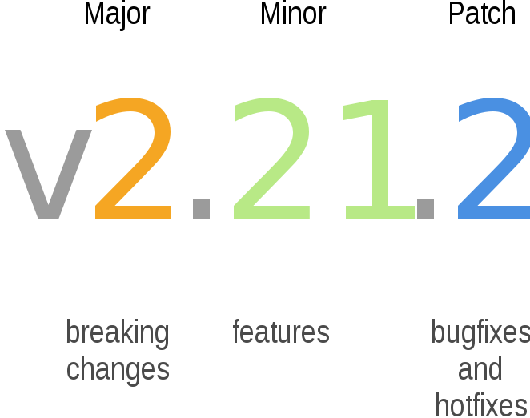

# Version control 

## Learning objectives

Upon completing this module the learner should be able to:

- utilise the versioning management system
- develop the structure of the RELEASE_NOTES.md file

## Slides (new)

[Download the slides regarding  here TBD](https://github.com/FAIR-by-Design-Methodology/IDCC24workshop/raw/main/resources/02%20Skills4EOSC/Skills4EOSC-IDCCworkshop_FAIR-by-Design_Methodology.pptx){:download}

## Introduction

Training materials should always be considered as a living and constantly changing object. It is very important to keep them updating and improving. But doing so, creates other challenges such as version management. The FAIR-by-Design Methodology uses Git as a versioning system, providing industry standard version management. Each new Git release is considered a new version of the learning materials. When doing so, it is very important to keep track of the changes made, as well as to have consistent version numbering system. 

## Version Management

Git is the most popular version management system in use today. It is available for all popular platforms either as a first-party command line utility or through third-party graphical user interface (GUI) clients. Git uses the concept of repositories which can granularly manage the versions of all objects placed within it. File changes are **committed** to a repository and each commit is automatically associated a unique and random identifier. In addition to this identifier, each commit is also described by its author, commit title and commit description. A single Git repository can be used by multiple users, each contributing and committing their changes. 

- To produce a new training material, one should fork the template repository, or the repository of any other ready made training material. 
- It is important to note that each commit to the repository, triggers the actions needed to update the associated Gitbook. 
- Each new Github release produces a new version of the learning material.

By default, the Gitbook shows the latest version (visible also in the URL as /latest). The dropdown list on the top of every Gitbook page enables quick access to all previous versions. 

!!! tip 

    **Git commit** – a granular change of a single or multiple files in the repository, identified by a random unique identifier, the committer's name, email address, short commit title and an optional longer commit description. A commit can contain file additions, modifications, removal, or relocation to a different directory. 

!!! tip

	 **Git clone** – an action to download locally an existing Git repository. A repository hosted on a public Git hosting service such as GitHub can be cloned by anyone (assuming it is public) on their local machines. Once downloaded, users can explore the repository and optionally send their contributed changes upstream, if they have been assigned the necessary permissions.

!!!tip 

	 **Git fork** – a 1:1 copy of an existing Git repository. A fork of an existing repository results with the creation of a brand new repository which will have a shared history with the original one up until the fork was made. The owner of the forked repository will be the user who initiated the fork. The original owner of the repository does not have any right in the forked repository by default.

!!!tip

	**Git release** - easch git release creates a new observable version of the Gitpages, as well as a new record (for the first release), or an updated record in Zenodo. 

### Release Notes
The release notes for each new version are intended to help the users of these materials to better understand the changes brought by each version. They can be useful both for the learners and for the instructors using the materials. 
Using the release notes enables tracking of all the versions of a learning material. They are written in a special Markdown file called `RELEASE_NOTES.md`. The content of this file is embedded as is on the Git book homepage (the syllabus) in a collapsible block.
Ideally, the RELEASE_NOTES.md file should list the various versions in a descending order, sorted by the release date.
[Example of a RELEASE_NOTES.md content](https://fair-by-design-methodology.github.io/FAIR-by-Design_ToT/latest/). 

## New iteration

The work on a new iteration starts once the list of identified improvements that will be incorporated into the new version is finalised.

The next step is to organise the work regarding the required changes to the learning materials. Depending on the identified improvements, the changes may bring you back to the Produce stage implementing changes in learning units, or even to Design if restructuring of the learning material is needed.

The **version number** is one of the things that you will need to provide when activating a new release. The recommendation based on best practices is to keep the versioning in the Major.Minor.Patch version number sequence.

- You will **increment the minor number** if the incremental improvement does not change the overall structure of the learning materials.
- You will **increment the major number** if the changes include change in the overall structure of the learning materials.
- **Increment the Patch number** in case of only technical fixes. 

The image below depicts the best practices of semantic versioning.

{: style="height:250px;"}

[Semantic Versioning](https://commons.wikimedia.org/wiki/File:Semantic-versioning.svg) by [Surjit Bains](https://commons.wikimedia.org/w/index.php?title=User:SurjBains&action=edit&redlink=1) on [Wikimedia Commons](https://commons.wikimedia.org/) licensed under the [Creative Commons Attribution-Share Alike 4.0 International](https://creativecommons.org/licenses/by-sa/4.0/deed.en) license.

Note that the provided automated workflow will not create a new independent record on Zenodo, but will **add a new version to the already existing Zenodo record**. 

## Summary 

Using version management, as well as clearly documented changes between the versions help both learners and instructors using a specific learning material. Producing a new version might include changes from quite small to quite significant ones. These should be reflected in the proper version numbering, and clearly explained in the accompanied files. The automated workflows that are part of the Methodology enable consistency between the Git repositories and the published releases on the Zenodo platform. 

## Suggested Reading

- [Skills4EOSC FAIR-by-Design Methodology for Learning Materials Development](https://zenodo.org/records/8419242)
- [Skills4EOSC FAIR-by-Design Methodology Continuous Impovement](https://fair-by-design-methodology.github.io/FAIR-by-Design_ToT/latest/Stage%206%20–%20Verify/20-Continuous%20Improvement/20-CI/?h=major+version#new-iteration)

