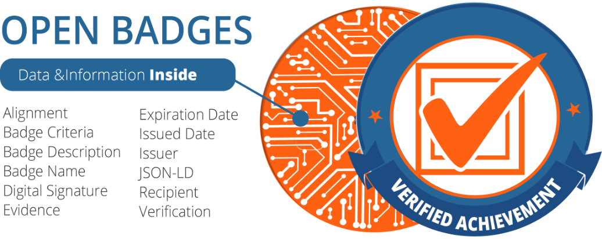

# Skills4EOSC Recognition Framework

Recognising the newly obtained skills is of great importance in the life long learning process. It is essential that there are mechanisms in place that can help learners obtain digital credentials reflecting their current skillsets.

## Learning Objectives

- discuss criteria for issuing digital credentials
- identify options for digital credentials

## Introduction

The Skills4EOSC Recognition Framework is designed to support the professional development and recognition of skills within the Open Science ecosystem. As Open Science becomes increasingly integral to research and data management across Europe, there is a growing need for a consistent and reliable way to certify the skills and competencies of professionals involved in this field. The framework addresses this need by providing a standardized approach to the use of digital credentials.

Key Aspects of the Skills4EOSC Recognition Framework:

1. Digital Credentials:
    - The framework leverages digital credentials, such as badges and certificates, to provide tangible, verifiable proof of skills. These credentials are awarded based on specific achievements, such as completing training programs, passing assessments, or demonstrating particular competencies.
	- Digital credentials are designed to be easily shareable, allowing professionals to include them in their CVs, LinkedIn profiles, or other online portfolios. This enhances the visibility and recognition of their skills across the European research community and beyond.
2. Supporting Open Science Professionals:
	- The framework is tailored to meet the needs of various stakeholders in the Open Science ecosystem, including researchers, data stewards, librarians, and other research support staff.
	- It recognizes both formal and informal learning, offering flexibility in how skills are acquired and validated. This is particularly important in a rapidly evolving field like Open Science, where new tools, methods, and practices are constantly emerging.
3. For Instructors and Learners:
	- Instructors: The framework provides instructors with a way to certify the competencies they impart to their learners, helping to establish their credibility and expertise in Open Science.
	- Learners: For learners, the framework offers a clear pathway to gaining and demonstrating the skills necessary for working effectively in Open Science. The credentials serve as proof of their proficiency, whether they are early-career researchers or experienced professionals expanding their skill set.
4. Employer Recognition Across Europe:
	- One of the core goals of the framework is to ensure that these digital credentials are recognized by employers across Europe. By establishing a common standard, the framework makes it easier for employers to assess and validate the skills of potential hires, regardless of their location or the specific training programs they have completed.
	- This cross-border recognition is crucial for fostering mobility and collaboration within the European Research Area (ERA), enabling professionals to move between countries and institutions while maintaining the value of their credentials.
5. Integration with Existing Initiatives:
	- The Skills4EOSC Recognition Framework is designed to align with other European initiatives, such as the European Open Science Cloud (EOSC), the European Skills, Competences, Qualifications, and Occupations (ESCO) framework, and the European Digital Credentials for Learning (EDCL) system. This integration helps ensure that the credentials are interoperable and widely accepted.
6. Promoting Lifelong Learning:
	- The framework encourages lifelong learning by recognizing continuous professional development. Professionals can earn credentials as they acquire new skills over time, helping them stay current with the latest developments in Open Science and related fields.
7. Contributing to a Sustainable Open Science Ecosystem:
	- By promoting the recognition of skills and competencies, the Skills4EOSC Recognition Framework contributes to the sustainability of the Open Science ecosystem. It supports the development of a skilled workforce that can drive the adoption and implementation of Open Science practices across Europe.

The [current version of the Recognition Framework](https://zenodo.org/records/10447619) is still in its draft phase and is available on Zenodo together with a link that asks for your [feedback](https://ec.europa.eu/eusurvey/runner/Skills4EOSCRecognitionFrameworkSurvey).

## Criteria for issuing digital credentials

Providing digital credentials, such as badges or certificates, can recognize both attendance at training and the successful completion of assessments. However, each approach has its own pros and cons.

### Digital Credentials for Attendance Only

1. Pros:
	- **Encourages Participation**: Offering credentials for attendance can motivate more individuals to participate in training sessions, as they receive recognition simply for being present.
	- **Inclusivity**: It allows all participants, regardless of their performance in assessments, to receive a credential, promoting inclusivity and reducing the pressure of assessment.
	- **Easy to Administer**: These credentials are straightforward to issue, as they do not require the evaluation of participant performance, reducing administrative overhead.
	- **Building a Learning Culture**: Recognizing attendance can contribute to a culture of continuous learning, encouraging individuals to engage in more training opportunities.
2. Cons:
	- **Limited Value**: Credentials for attendance may carry less weight since they do not necessarily indicate that the recipient has gained or demonstrated any specific skills or knowledge.
	- **Potentially Misleading**: These credentials could be misleading if interpreted as a sign of competency when they only signify participation.
	- **Lack of Differentiation**: There is no distinction between those who merely attend and those who actively engage and master the material, potentially diminishing the credential’s perceived value.

### Digital Credentials for Successful Completion of Assessment

1. Pros:
	- **Demonstrates Competency**: These credentials indicate that the recipient has not only attended the training but also successfully demonstrated understanding and application of the material, making them more meaningful and valuable.
	- **Higher Recognition**: Credentials based on assessment are often more respected by employers and peers, as they provide evidence of skills and knowledge.
	- **Motivates Learning**: Knowing that they must pass an assessment to receive a credential can motivate participants to engage more deeply with the training content.
	- **Differentiates Skill Levels**: This approach differentiates between those who have mastered the material and those who have not, which can be important in professional or academic settings.
2. Cons:
	- **Excludes Some Participants**: Those who struggle with assessments may not receive a credential, which could discourage participation and be seen as less inclusive.
	- **Increased Pressure**: Participants may feel more stressed or anxious about assessments, which could negatively impact their learning experience.
	- **More Complex Administration**: Administering assessments and issuing credentials based on performance requires more resources, including time, effort, and sometimes technology, to ensure fair and accurate evaluation.
	- **Risk of Credential Inflation**: If not carefully designed, assessments could lead to credential inflation, where the credential becomes less valuable due to inconsistent or low standards.

The choice between awarding digital credentials for attendance versus successful completion of assessments depends on the goals of the training program and the value you want to convey through the credentials. If the aim is to encourage broad participation and foster a learning culture, attendance-based credentials might be more suitable. However, if the goal is to ensure that participants acquire and demonstrate specific skills or knowledge, credentials tied to assessment performance are more appropriate.

## Digital Credentials

The two viable options proposed by the Recognition Framework are the Open Digital Badges and the European Digital Credentials. One can choose one of these types or even implement both of them as they are complementary in some aspects. 

### Open Digital Badges

Open Digital Badges are digital representations of achievements, skills, or knowledge that an individual has earned. These badges are often issued by educational institutions, employers, or professional organizations and can be shared across various platforms, such as social media, digital resumes, or professional networks.

Each Open Digital Badge contains metadata that includes information about the issuing organization, the criteria for earning the badge, the date of issue, and sometimes evidence of the achievement (such as a project or assessment). Badges are issued through a digital credentialing platform and can be verified by anyone viewing the badge, ensuring authenticity and credibility.

[Open Badge content by 1EdTech](https://openbadges.org/), licensed under [CC-BY-4.0](http://creativecommons.org/licenses/by/4.0/)

Pros:

- **Portability**: Easily shared and displayed across multiple platforms.
- **Transparency**: Contains detailed metadata that verifies the achievement.
- **Motivational**: Encourages learners by providing tangible recognition of their accomplishments.
- **Flexibility**: Can represent a wide range of achievements, from formal education to micro-credentials.

Cons:

- **Varied Standards**: Different issuers may have different criteria for awarding badges, leading to inconsistencies.
- **Recognition**: Not all employers or institutions may recognize or value badges equally.
- **Overwhelming**: The proliferation of badges can make it difficult for employers to assess their true value.

### European Digital Credentials

European Digital Credentials (EDCs) are a standardized form of digital certification recognized across the European Union. These credentials can represent educational qualifications, skills, or professional achievements and are designed to be interoperable across borders and institutions within the EU.

EDCs are issued by accredited institutions and include standardized metadata, ensuring consistency and interoperability across the EU. The credentials are verified through a secure digital infrastructure supported by the European Commission, making them trustworthy and easily portable between EU countries.

Image taken from [https://europa.eu/europass/en/stakeholders/european-digital-credentials](https://europa.eu/europass/en/stakeholders/european-digital-credentials) 

Pros:

- **Standardization**: Provides a consistent framework for recognizing qualifications across Europe.
- **Trustworthy**: Issued and verified by accredited institutions, ensuring high credibility.
- **Interoperability**: Recognized across all EU member states, facilitating mobility and cross-border employment.
- **Integration**: Can be integrated into national and EU-level qualifications frameworks.

Cons:

- **Limited Scope**: Primarily focused on formal qualifications and may not cover informal or micro-credentials as effectively as badges.
- **Bureaucracy**: The process of issuing and verifying EDCs can be more complex and time-consuming.
- **Flexibility**: Less flexible compared to open digital badges, particularly for informal learning achievements.

### Comparison

- **Recognition and Scope**: EDCs are more standardized and recognized across the EU, especially for formal qualifications, while Open Digital Badges are more flexible and can represent a broader range of achievements, including informal learning.
- **Flexibility**: Open Digital Badges are more adaptable to various types of learning and achievements, whereas EDCs are more rigid but offer higher standardization.
- **Portability**: Both are portable, but EDCs have an edge in cross-border recognition within the EU due to their standardized framework.
- **Credibility**: EDCs generally have higher credibility due to their issuance by accredited institutions and standardized verification process, while Open Digital Badges’ credibility can vary depending on the issuer.

Open Digital Badges and European Digital Credentials both serve as digital representations of skills and achievements but cater to different needs. Open Digital Badges are versatile, allowing for recognition of a wide array of learning experiences, but they may suffer from inconsistency and varying levels of recognition. European Digital Credentials, on the other hand, provide a highly standardized and credible form of certification recognized across the EU, making them ideal for formal qualifications but less adaptable to informal or micro-credentials. The choice between the two depends on the specific needs for recognition, portability, and the type of learning being credentialed.

## Summary

The Skills4EOSC Recognition Framework aims to standardize the use of digital credentials to provide Open Science professionals, both instructors and learners, with verifiable proof of their skills. This framework also enables employers across Europe to recognize and validate these competencies, ensuring consistent standards and fostering professional development in the field of Open Science.

Do not forget that the final version of the Recognition Framework is due to be out in March 2025.

## Suggested Reading

- Weisteen Bjerde, K., Green, D., Bjønnes, L., van Leersum, N., Filiposka, S., Kjorveziroski, V., Janik, J., Hadrossek, C., Bernier, M., Sowinski, C., Torres-Ramos, G., Antoine, D., Mendez Rodriguez, E. M., Lavitrano, M., Whyte, A., Di Giorgio, S., & Lazzeri, E. (2023). [D2.4 Skills4EOSC Recognition Framework first iteration](https://doi.org/10.5281/zenodo.10447619). Zenodo. https://doi.org/10.5281/zenodo.10447619
- [Open Badges Home](https://openbadges.org/)
- [EDC for learning](https://europass.europa.eu/en/europass-tools/european-digital-credentials)