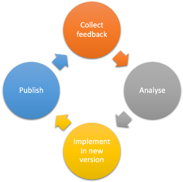

# Slides (new)

[Download the slides regarding the FAIR-by-Design Methodology here](https://github.com/FAIR-by-Design-Methodology/IDCC24workshop/raw/main/resources/02%20Skills4EOSC/Skills4EOSC-IDCCworkshop_FAIR-by-Design_Methodology.pptx){:download}

# Introduction

## Incremental improvements 

Learning materials are never completely finished. There is always room for improvement and many times need and requirement to keep up to date with the development and changes in the field of subject of the learning materials.

Therefore a regular analysis of all QA aspects is necessary to identify potential elements for improvement. Based on the outcomes of the feedback analysis, the authors of the learning materials should make a plan for the development of a new version of the learning materials. 
 
### Feedback analysis 

As discussed in the previous learning unit, there are multiple sources that can serve for feedback gathering and QA:

- feedback form
- external QA recommendations
- self-reflection after training 
- GitHub issues
- gathered comments from external contributors
- direct mail contact 
- any other means of communication (e.g. feedback from workshops, discussions, team meetings, etc.)

The input from all of these sources should be gathered and analysed. The results of the analysis should be a list of potential improvements, each marked with an impact level (high, moderate, low). 

The next step is to decide which of the improvements will be addressed in the next version and how will this be achieved. Note that depending on the number of identified improvements, you might need to go through the improvement cycle multiple times. It is recommended that the changes are done in an incremental fashion and that changes done in one version are logically related. This help both developers and users to better understand the differences between the versions.

{: style="height:350px;"}

# Summary 

# Suggested Reading

- [Skills4EOSC FAIR-by-Design Methodology for Learning Materials Development](https://zenodo.org/records/8419242)

