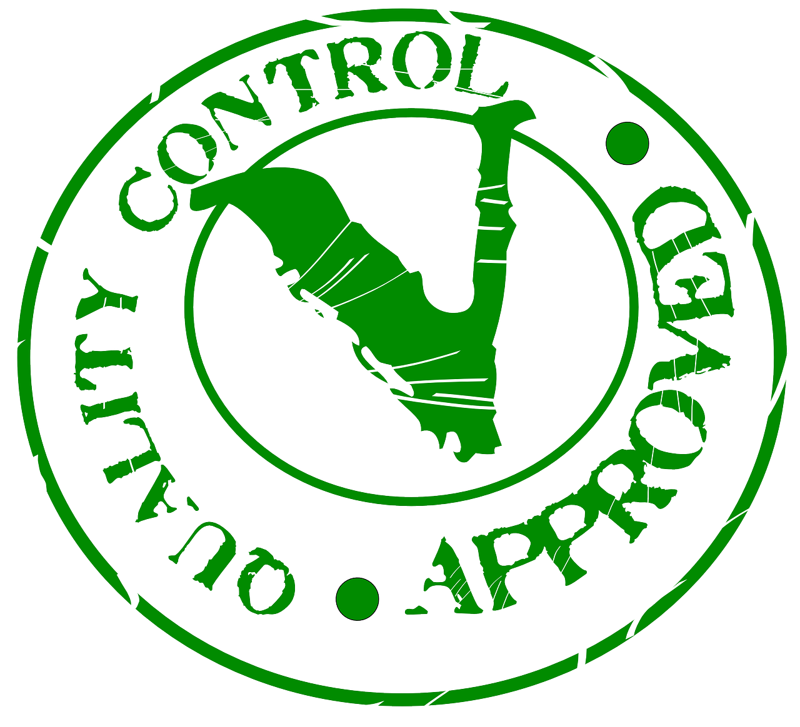

# Quality Assurance Framework

## Slides

[Download the slides here](https://github.com/FAIR-by-Design-Methodology/CLARIN-Training/raw/main/resources/2nd%20Session/06%20Quality%20assurance%20/QA.pptx){:download}

Once the learning materials are made available for both the learners' and instructors' communities it is prudent to verify that all is as it should be including the FAIR aspects of the learning materials. This is a good moment when an external quality assurance (QA) can be engaged to assess the produced learning materials from both the learners' and instructors' perspective.

For these purposes you can use the [QA guidelines and checklists developed by Skills4EOSC T2.4](https://doi.org/10.5281/zenodo.8305482).

## Learning Objectives

Upon completing this module the learner should be able to:

- perform a QA assessment of learning materials
- rate FAIRness of learning materials

## Self-check QA

The final goal of the FAIR-by-Design instructional design process is to create FAIR learning materials for both learners and instructors. Therefore, it is imperative that you first go through a self-check phase to ensure everything is as intended. For these purposes you can use the [QA guidelines and checklists developed by T2.4](https://doi.org/10.5281/zenodo.8305482).

{: style="height:200px;"}

Image by [Shahid Abdullah](https://pixabay.com/users/472301-472301/?utm_source=link-attribution&utm_medium=referral&utm_campaign=image&utm_content=1622517) from [Pixabay](https://pixabay.com//?utm_source=link-attribution&utm_medium=referral&utm_campaign=image&utm_content=1622517)

Skills4EOSC has developed a number of QA checklists that should be used for this process, two of which are presented in this text. For the full list of checklists and their use please refer to [D2.3](https://doi.org/10.5281/zenodo.8305482). The three QA checklists that are listed here as part of the verification process are:

- the general QA checklist that focuses on the learning materials content and analyses it from a learners' perspective
- the FAIR-by-Design QA checklist that focuses on the FAIR aspects of the learning materials and requirements imposed with the use of the methodology
- the ELSI checklist that focuses on the ethical, legal and societal issues related to the development of the learning materials

### General QA

The general QA checklist developed by Skills4EOSC addresses the main aspects of the developed learning materials that are related to their quality as perceived by the learners. 

In the following table these aspects are related to the steps or fields from the FAIR-by-Design methodology to help you understand where, or at which point, this aspect is being addressed by the methodology.

| **Checklist question** | **FAIR-by-Design element** |
|---|---|
| Does the learning material title clearly describe what it offers? | syllabus (metadata) |
| Does the learning material include its goal? | syllabus (metadata) |
| Does the learning material clearly state its target audience? | syllabus (metadata) |
| Does the learning material state the level of expertise it is required from its audience? | syllabus (metadata) |
| Are the learning objectives/outcomes specific, well-defined, and measurable? | syllabus (metadata) |
| Does the learning material clearly describe its program / outline? | syllabus (metadata) |
| Does the learning material cover different learning styles? | learning content |
| Does the learning material states its delivery method? (live sessions, self-learning, hybrid, face-to-face...) | syllabus (metadata) |
| Does the learning material state the date when it was published and/or the date of the newest version? | syllabus (metadata) |
| If needed, does the learning material state the dates the training takes place?  | syllabus |
| Does the learning material states the expected duration of the training? | syllabus |
| Does the learning material specify the developer/author of the learning material? | syllabus |
| Does the learning material specify the trainer/s of the learning material? | syllabus |
| If applicable, does the learning material explain the required tools/software/infrastructure as well as acceptable assignment submission types? | syllabus + learning unit |
| Does the learning material include any assignment? Are assessment strategies consistent with learning material objectives and are clearly stated? | activities |
| Is grading policy provided in a manner that clearly defines expectations for the learning material and respective assignments? | quiz strategy |
| Is the learning material comprised of micro-credentials that can be aligned to create a larger milestone credential? | certification information in syllabus and learning units |
| Does the learning material end with an activity that allows for feedback? | feedback form |
| Does the learning material include relevant keywords related to the content and structure? | syllabus (metadata) |
| Does the learning material include information regarding whether the access to it implies costs? | syllabus (metadata) |
| Does the learning material state the language used? | syllabus (metadata) |

### FAIR-by-Design Methodology QA checklist

With the FAIR-by-Design methodology QA checklist you can check if you have followed the most important aspects of the methodology and managed to produce FAIR learning materials. 

The questions marked as **essential** are related to the major FAIR aspects of the obtained learning material. These elements must be present so that the learning materials are achieving **bare minimum FAIRness**. 

By complying with the rest of the items you are increasing the FAIRness and quality of the learning materials.

| **Essential** | **Topic** | **Stage** | **FAIR aspect** | **Goal** | **CHECKLIST   QUESTION** |
|:---:|---|:---:|:---:|---|---|
|   | Instructional design process | Prepare | / | Learner-centric   learning resources | Did   you follow the stages of the backward instructional design process while   developing the learning resource? |
| YES | Schema | Prepare | Interoperable | Choose   a metadata schema to describe the material, such as the RDA minimal metadata   schema | Is   the RDA minimal (or domain specific) metadata schema used for the learning   material description? |
|   | Vocabularies | Prepare | Interoperable | Define   controlled vocabularies for certain fields such as main keywords; learning   objectives, audience, microcredentials.. using the controlled vocabularies   related to the schema | Are   controlled vocabularies (CVs) used for describing the resource   characteristics aligned with the chosen metadata schema? |
| YES | License | Design | Reusable | Reuse   of licensed materials with attribution | If   applicable, is there clear attribution for all reused resources with   compatible licenses? |
| YES | License | Design | Reusable | permissable   license allowing reuse and adaptations | Has   the learning resource been made available for use by defining a permissable   license or policy information that allows derivations? |
|   | Structure | Design | Reusable | Decide   the level of aggregation on which FAIR will be implemented. The more granular   the better reuse | Does   the learning resource represent a complete learning object or aggregation   consisting of content, tools and implementation resources defined around   minimum one learning objective? |
|   | Facilitator   kit | Design | Reusable | Develop   an instructor kit (how to, tips & tricks...) that should help facilitate   the proces of others reusing the learning material | Does   the resource incorporate an instructor kit that aids in facilitating the   process of others reusing learning material by offering helpful how-to   guides? |
| YES | Tools   & Formats | Produce | Interoperable | Use   interoperable tools that will enable you to save the intermediate (editable)   and final content in open file formats | Is   your resource available in open file formats which are tool agnostic and   compatible with a wide variety of existing software? |
| YES | Metadata | Produce | Findable | Describe   the material (all FAIR objects) using the rules provided in the chosen schema | Is   metadata for the resource provided in both human- and machine-readable format   (e.g JSON, XMLor YAML? |
| YES | Accessibility | Produce | Accessible | Ensure   accessibility of the material by people with different learning styles and/or   with disabilities. | Has   an accessibility checker tool been utilised to improve the accessibility of   all learning resource files (PDF, HTML, video, etc.)? |
|   | Versioning | Publish | Reusable | Use   a versioning system to implement document version control. New versions are   released with a new DOI. | Have   you employed a versioning system to track and control changes in your   materials? |
| YES | Repositories | Publish | Findable | Publish   the new version of the learning materials & metadata | Is   the complete learning resource (including instructors info) registered or   indexed in at least one searchable repository? Is it in a FAIR repository? |
|   | Access   rules | Publish | Accessible | Ensure   all material is widely accessible by defining open access rules for learning   and reuse | Are   the resource access rules (how to access, e.g. registration procedure)   explicitly communicated to learners? |
| YES | Access   rules | Publish | Accessible | Ensure   all material is widely accessible by defining open access rules for learning   and reuse | Are   access rules (authentication & authorisation) implemented for the   learning resource? |
|   | Catalogue | Publish | Findable | Improve   findability by creating an entry in a selected training catalogue(s)   (thematic, project, regional, general, etc.) | Is   the learning resource searchable in at least one relevant catalogue? Is it   FAIR (can be searched based on metadata)? |
|   | Cocreation | Verify | Accessible | Enable   the possibility to gather feedback and comments from users and peers | Does   the course include the possibility to provide feedback or comments from users   and-or trainers/designers? If so, do you regurarly gather and analyse that   feedback? |
|   | Cocreation | Verify | Reusable | community   building | Does   the resource adopt an open community approach regarding its quality and   reachability? |
|   | QA | Verify | / | external   QA | Has   the learning resource been checked by a third party regarding its learning   experience quality? |
|  | FAIR |   | FAIR | Results | Does   the resource align with the FAIR-by-design methodology principles? |

### ELSI QA checklist

The ELSI sub-framework defines the specific features that the Open Science learning resource should include related to Ethical, Legal, and Social issues. 

To guarantee the quality of the learning resource, it's important to score at least 1 in all the essential indicators. This shows that the resource meets the minimum ELSI quality standards. If the resource does not meet this threshold, more steps are needed to make sure it follows the necessary ELSI requirements.

| **Essential** | **Topic** | **CHECKLIST   QUESTION** |
|:---:|---|---|
| YES | Terms of Service | Does the resource provide or refer to Terms of Service (ToS)? If so, is the ToS versioned? |
| NO | Terms of Service | If needed, does the resource provide ToS authentications/registration sections? |
| NO | Terms of Service | If needed, does the resource provide ToS information about charging and quotas? |
| NO | Intellectual Property Rights | Are the types of Intellectual Property (IP) and other types of rights subsisting in a resource identified? |
| YES | Intellectual Property Rights | Is the IP owner identified? Is the identity of the author / inventor or other IP originator identified? |
| NO | Intellectual Property Rights | Is provenance or other type of IP acquisition related information provided? |
| NO | Intellectual Property Rights | If applicable, is the licence of the resource Public Domain equivalent? |
| NO | IPR – Restrictions | Are there any Trade Secrets contained in the resource? |
| NO | IPR – Restrictions | If there any restrictions from cultural heritage law (e.g. in the use of pictures), personality rights and/or other rights that may require additional licence/authorization, are they provided? |
| YES | IPR - licensing out | Does the resource provide the standard licences used? |
| YES | IPR - licensing out | Does the resource provide a machine and human readable version of the licence? |
| NO | IPR - licensing out | If applicable, is there an available URL location of the licence or policy of the material/s? |
| NO | IPR - licensing out | Is the licence of the resource versioned? |
| NO | IPR - Open Licences | Is the licence compliant with Free Cultural Work or the Free Software Foundation (FsF) definition? |
| NO | IPR - Open Licences | Is the licence Open Permissive? |
| NO | IPR - Open Licences | Is the licence Open Protective (Copyleft)? |
| YES | IPR - Open Licences | Are the licences used interoperable with each other? |
| NO | Personal Data | If applicable, are conditions for further processing (if allowed) provided? |
| NO | Personal Data | If applicable, are the data subjects rights provided? Are communication addresses (e.g. email) provided? |
| NO | Ethics | Are there any ethical rules provided? |
| NO | Ethics | Are there any Codes of Conduct (CoC) provided? |
| YES | Ethics | Is there attribution to the data source? |
| YES | Ethics | Is data provenance provided? |
| NO | Public Sector | Is this resource identified as research data under the Open Data Directive? |
| NO | Public Sector | Is this resource identified as a High-Value Dataset? |

## External QA

To truly view the produced learning materials through the lenses of learners and other instructors, you need to perform a QA check with the help of an external party. This external party should be someone who has not been involved in any step of the materials design, better yet has not seen the materials ever before. In this way, you will have a pair of fresh eyes that will review the learning materials without any cognitive bias. 

{: style="height:200px;"}

Image by [OpenClipart-Vectors](https://pixabay.com/users/openclipart-vectors-30363/?utm_source=link-attribution&utm_medium=referral&utm_campaign=image&utm_content=147677) from [Pixabay](https://pixabay.com//?utm_source=link-attribution&utm_medium=referral&utm_campaign=image&utm_content=147677)

To further support this effort the chosen QA reviewer should be an expert that is very well versed in the requirements for engaging learning content and learning styles, as well as the FAIR principles. It is their job as an external QA reviewer to evaluate the learning materials performance, quality, and suggest improvements using an objective and independent perspective.

The external QA reviewer can use the Skills4EOSC QA guidelines and checklists as a starting point for the QA, but should be encouraged to go more in-depth with the review process. 

The high impact recommendations in the QA review report should be resolved as soon as possible. The lower level improvement recommendations can be taken into account as relevant input for the continuous improvement step.

### Learners experience QA

In addition to the checklists the QA review should also ensure that the course available for learners. For instructor-led trainings and courses this must be done before the scheduled training takes place. 

For these purposes the QA reviewer should assume the role of a learner and try to:

- access the course information
- register or self-enrol in the course
- go through **all** of the resources available on the course
    - including playing multimedia, quizzes, feedback form and any other type of interaction

Any identified problems should be resolved as soon as possible. 

## Summary

Performing a QA self-check after publication is an essential step that aims to ensure that all stages of the FAIR-by-Design methodology have been implemented successfully and the learning materials are accessible and presented as planned. 

The [QA guidelines and checklists developed by Skills4EOSC](https://doi.org/10.5281/zenodo.8305482) can be extremely helpful when it comes to QA.

By engaging an external QA reviewer you are demonstrating your commitment to producing high-quality learning materials and provide accountability to your learners, the instructors community and the public in general.

## Suggested Reading

- [Sánchez, M., Méndez, E., Whyte, A., Weisteen Bjerde, K., Martínez, S., Bueno, G., & Ucar, I. (2023). D2.3 Community-endorsed quality assurance and certification framework for professional training and qualifications (1.3). Zenodo. https://doi.org/10.5281/zenodo.8305482](https://doi.org/10.5281/zenodo.8305482)

- [Training Check. The TrainingCheck Approach TrainingCheck.](https://www.trainingcheck.com/help-centre-2/guide-to-training-evaluation/the-trainingcheck-approach-2/)

- [NHS Shared Learning. Quality Assurance Checklists for Evaluating Learning Objects and Online Courses. 2009.](https://www.knowledge.scot.nhs.uk/media/4088630/quality_assurance_checklists.pdf0)

- [zipBoard. eLearning Quality Assurance Checklist with use cases and examples. August 2020.](https://zipboard.co/blog/elearning/elearning-qa-checklist/)

- [FAIR Training Handbook. New chapter on assessing FAIRness](https://elixir-europe-training.github.io/ELIXIR-TrP-FAIR-training-handbook/)
