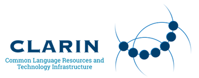

---
# RDA learning materials metadata minimal set
title: "FAIR-by-Design training for the CLARIN community"
author: 
    - Sonja Filiposka 
    - Anastas Mishev
    - Athina Anastasopoulou
    - Francesca Frontini
    - Giulia Pedonese
    - Iulianna van der Lek
tags: 
    - "FAIR learning materials"
    - "FAIR-by-Design methodology"
    - "FAIR instructional design"
    - "FAIR quality assessment"

abstract: "When developing learning materials, it is essential to ensure they are FAIR (Findable, Accessible, Interoperable, and Reusable) from both the learners' and trainers' perspectives. Therefore, integrating FAIR principles into the development of learning materials is a crucial element. This training introduces the CLARIN community to the FAIR-by-Design Methodology, which provides a systematic approach that embeds the FAIR principles into the backward instructional design process."
primaryLanguage: "EN"
license: "http://creativecommons.org/licenses/by/4.0/"
versionDate: "2024-09-19"
urlToResource: "https://doi.org/10.5281/zenodo.13816183"
resourceURLType: "URL"
targetGroup: "Training materials designers, Training workflow and infrastructure managers"
learningResourceType: "GitBook"
learningOutcome: 
    - Describe training materials using metadata
    - Structure comprehensive learning materials
    - Develop a facilitation kit
    - Adapt and mix learning materials
    - Publish FAIR-by-Design learning materials
    - Collaborate with other instructors
    - Assess FAIR-ness of learning materials
accessCost: "N"
expertiseLevel: "Beginner"
---

# Introducing the FAIR-by-Design Methodology to the CLARIN community 

{!RELEASE_NOTES.md!}

## Workshop

## Date/Time: 
- Session 1: Fri, 20 Sep 2024 14:00 - 17:00 CEST
- Session 2: Thu, 26 Sep 2024, 14:00 - 17:00 CEST

## Location: 
Online

## Description

When developing learning materials, it is essential to ensure they are FAIR (Findable, Accessible, Interoperable, and Reusable) from both the learners' and trainers' perspectives. Therefore, integrating FAIR principles into the development of learning materials is a crucial element. This training introduces the FAIR-by-Design Methodology, which provides a systematic approach that embeds the FAIR principles into the backward instructional design process.

During the training session, the participants will:

- Gain an in-depth understanding of the FAIR-by-Design workflow where each stage highlights different aspects of the learning materials design process.
- Learn practical techniques for implementing the methodology to produce high-quality FAIR learning materials.
- Engage in discussions to explore how these principles can be applied in specific real-world scenarios.

This event is organised by CLARIN ERIC, CLARIN-IT and H2IOSC in conjunction with the Skills4EOSC project.

## Target audience

- CLARIN Trainers' Network, Ambassadors and members of the CLARIN thematic committees involved in the development of training and learning resources
- CLARIN-IT members involved in training activities in the H2IOSC project
- Anyone interested in the topic is welcome to join the session and learn

## Expertise Level / Skill Level: Beginner

## Primary Language: English

## Access Cost: N 

## Prerequisites: Basic knowledge of working with GitHub repositories and MD files

## Duration: 2 x 3 hrs

## Training objectives

- Describe training materials using metadata
- Structure comprehensive learning materials
- Develop a facilitation kit
- Adapt and mix learning materials
- Publish FAIR-by-Design learning materials
- Collaborate with other instructors
- Assess FAIR-ness of learning materials

## Keywords

- FAIR learning materials
- FAIR-by-Design methodology
- FAIR instructional design
- FAIR quality assessment

## Agenda:
### First session: 20th Sep 2024
| Time | Topic             |
|-----------|-------------------|
| 14:00 - 14:05  | Welcome   |
| 14:05 - 14:10  | About CLARIN   |  
| 14:10 - 14:25  | About Skills4EOSC       |
| 14:25 - 14:55  | Overview of the FAIR-by-Design Methodology |
| 14:55 - 15:15  | Metadata Schema & Controlled Vocabularies       |
| 15:15 - 15:40  | Facilitator Kit   |
| 15:40 - 15:50  | Break   |
| 15:50 - 16:15  | Rich learning experience |
| 16:15 - 16:30  | Citing & Attribution |
| 16:30 - 16:50  | Hands-on |
| 16:50 - 17:00  | Q&A |

### Second session: 26th Sep 2024
| Time | Topic             |
|-----------|-------------------|
| 14:00 - 14:05  | Welcome   |
| 14:05 - 14:20  | Session 1 Recap   |  
| 14:20 - 14:40  | Version control       |
| 14:40 - 15:05  | Recognition framework |
| 15:05 - 15:25  | Publishing considerations       |
| 15:25 - 15:40  | Co-creation   |
| 15:40 - 15:50  | Break   |
| 15:50 - 16:15  | Quality assessment |
| 16:15 - 16:40  | Hands-on |
| 16:40 - 16:55  | Q&A |
| 16:50 - 17:00  | Wrap-up |

## Resources and Materials

Official event page: 

All resources and materials can be found at [https://github.com/FAIR-by-Design-Methodology/CLARIN-FBD-Training](https://github.com/FAIR-by-Design-Methodology/CLARIN-FBD-Training)

## Author(s)

Sonja Filiposka, Anastas Mishev, Athina Anastasopoulou, Francesca Frontini, Giulia Pedonese, Iulianna van der Lek

# Trainer(s)

Sonja Filiposka, Anastas Mishev, Athina Anastasopoulou, Francesca Frontini, Giulia Pedonese, Iulianna van der Lek

## Contact information

[sonja.filiposka@finki.ukim.mk](mailto:sonja.filiposka@finki.ukim.mk)

## License

 This work is licensed under a <a rel="license" href="http://creativecommons.org/licenses/by/4.0/">Creative Commons Attribution 4.0 International License</a>.

## DOI

[https://doi.org/10.5281/zenodo.13816183](https://doi.org/10.5281/zenodo.13816183)

## Accessibility Mission

Skills4EOSC is dedicated to ensuring that all produced learning materials are accessible to as many visitors as possible regardless of their ability or technology. We have an active commitment to increasing our learning materials accessibility. The main standards that we aim to comply with are WCAG v.2.1 Level AA criteria and PDF/UA (ISO 14289).

## Acknowledgement

These learning materials have been developed by following the [FAIR-by-Design Methodology](https://doi.org/10.5281/zenodo.7875540).

The FAIR-by-Design methodology learning materials provided in this training are based on:

- Filiposka, S., Mishev, A., & Leister, C. (2024, June 10). [FAIR-by-Design Microlearning](https://doi.org/10.5281/zenodo.11548062). Zenodo. https://doi.org/10.5281/zenodo.11548062
- Filiposka, S., Mishev, A., Kjorveziroski, V., & Leister, C. (2024, July 1). [FAIR-by-Design Learning Materials Methodology Training of Trainers](https://doi.org/10.5281/zenodo.12604767). Zenodo. https://doi.org/10.5281/zenodo.12604767
- Filiposka, S., Green, D., Mishev, A., Kjorveziroski, V., Corleto, A., Napolitano, E., Paolini, G., Di Giorgio, S., Janik, J., Schirru, L., Gingold, A., Hadrossek, C., Souyioultzoglou, I., Leister, C., Pavone, G., Sharma, S., Mendez Rodriguez, E. M., & Lazzeri, E. (2023). [D2.2 Methodology for FAIR-by-Design Training Materials (1.4)](https://doi.org/10.5281/zenodo.8305540). Zenodo. https://doi.org/10.5281/zenodo.8305540

 

